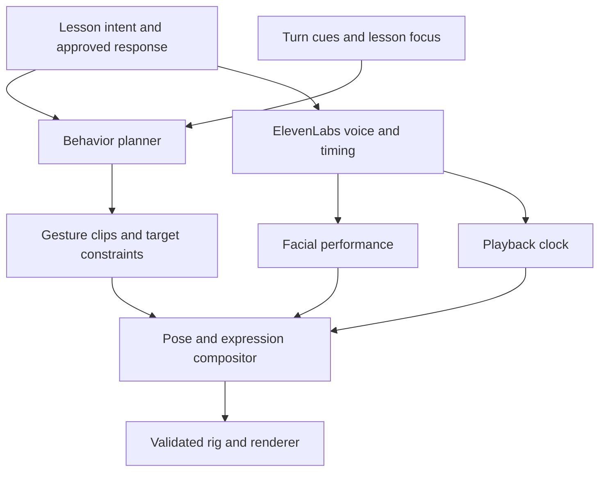

# Natalie: conversational realism audit and production pipeline

Date: 2026-09-10. Repository inspected: `mikevocalz/moyolearn`, main at `3a244858d2a9c380bd99f12f9355791227b36f8d`.

SOT-KEYWORDS: natalie realism presence gesture rig fingers listening phoenix seamless interaction bones seed gnm retarget speech timing

## Decision

Keep Moyo's rigged 3D tutor and build a coordinated performance around her. The full rig supplies the degrees of freedom; a conversational performance system must decide what to do with them and when. More active channels are not evidence of more natural behavior. A convincing tutor needs purposeful movements, believable transitions, and comfortable stillness.

The supplied transcript is Tavus **Phoenix-4.5**, released September 10, 2026. Tavus describes a conversational animator and a GAN-based half-body video renderer. The relevant benchmark is coordination across speech, face, head, and posture, including listening. It is not a drop-in skeletal animation system for Moyo's 3D/XR character. Tavus's performance and preference numbers are vendor-reported and are not Moyo acceptance results. [Official release](https://www.tavus.io/blog/phoenix-4-5).

## What the repository actually does

| Finding | Evidence and consequence |
|---|---|
| The mobile and application web stages use the Humano/Rigify asset and `createHumanoPresence`. | `packages/app/features/tutor/tutor-avatar-3d.{native,web}.tsx`. The existence of GNM code elsewhere does not mean the visible tutor is driven by GNM. |
| The marketing site had a separate animation implementation. | `apps/web-vite/src/components/chapters/natalie-scene.tsx`: random beat timers, a whole-line arm lift, and an elbow multiplier of 1.3. App fixes did not reach this controller. |
| The shared runtime also started beats on a random countdown. | `packages/avatar/src/presence/humano.ts`. Changing interval or amplitude alone cannot make these gestures match meaning or emphasis. |
| Both shipped assets contain zero animation clips. | Parsed the actual marketing GLB and phone glTF. Their node definitions and skin joint lists match; their inverse-bind accessor indices differ. Neither contains a captured listening/idle library. |
| Rigify controls are not equivalent to deform bones after export. | The existing `rig-axes.test.ts` measures skin influence and local axes. The shared writer uses deform bones and mirrors torso/head changes to the parallel chain carrying eyes, teeth, and arms. Reverting to `head`, `neck`, and `chest` control writes would recreate the old failure. |
| Fingers were continuously driven by ten independent noise channels. | The rig was being exercised, but perpetual uncorrelated finger activity can read as fidgeting. |
| Head pitch included `jawOpen * 0.05`. | Each mouth opening directly moved the skull. This is not phrase cadence. |
| Listening nods could start every 2–4 seconds. | `idle/engine.ts`: sustained typing/speaking triggered a timer, independent of a conversational acknowledgment opportunity. |
| The reduced-motion implementation contradicted its policy. | `reduced-motion.ts` preserves mouth and blink. The old writer suppressed mouth animation and froze the idle engine's blink clock. |
| Live Audio2Face has a client contract, but the repository records the GPU host as pending. | `docs/decisions/adr-112-live-audio2face.md`, `packages/voice/src/a2f.ts`. This audit does not establish the current production environment configuration. |
| Some quality claims are only proxies. | A raw-engine test requires body movement every two seconds. Passing it does not establish naturalness, purposeful stillness, semantic timing, or user preference. |

## Changes in this branch

- Marketing now uses the same presence writer as native and application web, with a cloned skeleton per mounted scene. The old duplicate bone writer and random beat loop are removed.
- Speech beats require a sustained articulation onset after a gap. A cooldown only suppresses an event; expiry cannot start a movement. The constant two-arm speaking lift is removed.
- The fallback gesture is restrained and unilateral. Its hand and fingers follow the same side; the other hand can rest.
- Finger resting shapes change gradually with a posture adjustment, then hold. Continuous balance sway is reduced from 10 mm to 3 mm; existing held weight shifts and torso turns remain.
- Mouth opening no longer drives head pitch. Listener nods require a pause/falling-pitch cue and cannot start while the tutor speaks.
- Reduced motion pins procedural body channels while retaining speech articulation and blink timing. Wrist follow-through uses small integration steps to remain bounded at low frame rates.
- Marketing caption-only actions no longer create speaking gestures or lip movements. Their duration still progresses with reduced motion enabled.

**This is a corrective runtime patch.** The new fallback sees articulation, not word meaning or measured vocal stress. It must not be described as semantic gesture generation, motion capture, or a learned conversational model. No motion dataset or model weights were imported, no character asset was replaced, and no GPU service was provisioned.

## How to use the supplied resources

| Resource | Best role for Moyo | Integration boundary |
|---|---|---|
| [BONES-SEED](https://huggingface.co/datasets/bones-studio/seed) | Retrieve candidate gestures, small turns, posture changes, and object interactions. Its Communication package lists 21,493 motions; Interactions lists 14,643. | SOMA BVH motion requires retargeting to Natalie's actual rig. “Interactions” includes object manipulation; it does not by itself mean two-person conversation. Inspect contact requirements and available finger tracks per clip. |
| [Seamless Interaction](https://huggingface.co/datasets/facebook/seamless-interaction) | Study the coupling between speaker and listener: acknowledgment, turn yielding, gesture timing, gaze, and facial response. | Provides paired audiovisual recordings and features including SMPL-H pose, hands, transcripts, and VAD. Those representations are not directly compatible with Rigify or GNM. Dataset availability does not establish deployable model weights. |
| [GNM demonstration](https://huggingface.co/spaces/hugging-apps/gnm) and [official GNM implementation](https://github.com/google/GNM/tree/main/gnm/shape) | Validate facial geometry and expression/pose controls; build a calibrated facial adapter for the intended GNM head. | GNM supplies geometry and control spaces. Its semantic sampler is not a speech-conditioned performance planner. The demonstrated face controls do not animate Moyo's body automatically. |

SEED's current license is restricted: startup eligibility includes annual revenue below $1 million, raw-data redistribution is prohibited, and competing motion-generative uses are restricted. Confirm eligibility and rights for the intended embedded/retargeted clip distribution before putting motion assets in this public repository. [BONES-SEED license](https://bones.studio/info/seed-license).

Seamless Interaction's dataset is **CC BY-NC 4.0**; commercial reuse requires explicit permission. Use the published methodology to inform the design now. Training or distributing a commercial derivative needs a suitable grant; retargeting or baking does not remove the underlying restriction. [Dataset terms](https://huggingface.co/datasets/facebook/seamless-interaction#-license--data-usage-policy).

## The production performance pipeline

### 1. Keep one scheduled performance clock

Build each approved utterance into a performance containing its audio, timing/alignment, facial curves, and gesture cues. Give it an utterance/generation identifier. Schedule all channels from the audio playback position; never from response-arrival time, network chunk arrival, or an independent render timer.

ElevenLabs documents an endpoint that streams audio together with character timing. Evaluate it with Moyo's chosen model and pronunciation settings, preserve normalized-text mapping, and validate timing against the actual returned audio. Character timestamps are useful anchors; letters are not phonemes. Never extrapolate Spanish or other languages from the marketing demo's English letter rules. [ElevenLabs speech with timing](https://elevenlabs.io/docs/api-reference/text-to-speech/stream-with-timestamps).

Plan a small amount of motion ahead of playback so preparation precedes the relevant spoken emphasis. The gesture's meaningful stroke belongs near that emphasis; its hand need not move on every syllable. Do not start a late gesture after its word has passed. Interruption cancels queued cues for the old generation and transitions the active pose into listening without resetting the skeleton.

### 2. Use a finite, authored behavior vocabulary

Use the existing `PERMITTED_GESTURES` as the starting vocabulary. Expand only with approved tutor behaviors, selected from observable lesson state and the tutor's intended delivery:

| Lesson moment | Coordinated performance |
|---|---|
| Waiting while a learner works | Settled hands, small breathing, occasional posture adjustment. Attention remains available without repeated nods. |
| Learner finishes explaining | A small acknowledgment after the appropriate boundary, followed by a brief pause before responding. |
| Offering a hint | Brief gaze toward the referenced item, one restrained open-palm offer if useful, then return attention to the learner. |
| Comparing two ideas | Left/right spatial indication only when the corresponding lesson targets really exist. |
| Learner asks for clarification | A thoughtful pause and focused expression; then a slower explanation with fewer gestures. |
| Recognizing effort | A brief, warm facial response and an appropriately sized gesture. Avoid constant celebratory motion. |
| Interrupted mid-sentence | Stop voice, retract or finish the safe part of the gesture, settle, and listen. |

A nod should not imply that an incorrect answer is correct. Trigger acknowledgment separately from pedagogical approval. Do not infer a child's internal emotion from appearance. “Notice confusion” should first mean explicit help requests, corrections, repeated attempts, and conversation context, with uncertainty handled honestly.

### 3. Author and retarget a small motion library first

Begin with a compact set of licensed or commissioned performances: relaxed standing, attentive listening, quiet thought, slight torso turn, weight transfer, one-hand offer, board indication, small acknowledgment, and interruption settling. Record several takes by the same performer for a consistent tutor personality. Record fingers and face where feasible; avoid a collage of incompatible acting styles.

For SEED candidates, filter metadata for appropriate posture, neutral style, relevant descriptions, displacement, repetition, and prop requirements. Preview the full transition into and out of the motion. Exclude interactions requiring a chair, desk, pen, or held object unless Moyo actually supplies that contact.

Retarget offline: verify units, forward/up axes, reference pose, pelvis height, shoulder offsets, joint limits, twist distribution, finger joint semantics, and the actual skinned hierarchy. A BVH name map is insufficient. Bake constraints into the export. Preserve the deformation/control-chain relationship needed by this asset's eyeballs and arms.

Store clip metadata: source and license record, skeleton/version hash, supported posture, hand availability, semantic tags, preparation/stroke/hold/retraction times, valid entry/exit poses, contact anchors, affected joints, and bounds. Ship optimized clips on demand through the existing avatar asset system rather than bundling a research dataset into the app.

### 4. Compose one physically coherent pose

Use a captured/authored base pose, a selected semantic gesture, restrained secondary motion, and final gaze/contact constraints. Assign ownership per joint/channel. The current writer restores bones to its captured rest each frame; adding an `AnimationMixer` beside it would erase or double-drive motion. Introduce a real compositor before mixing clips into this controller.

Blend rotations in the correct local frames, using quaternion interpolation and reference-pose-relative additive deltas. Preserve velocity across interruption/transition boundaries. Plant feet and constrain the support pose. Use IK for actual board/object targets, with stable elbow direction and hand orientation. Prevent hands passing through the torso, fingers penetrating the palm, shoulder shrugging during every breath, and sleeves clipping during a gesture.

Coordinate hands anatomically: a stable relaxed arc, mild finger coupling, differentiated thumb opposition, wrist/forearm rotation, and overlapping follow-through. Independent noise on every phalanx is not hand realism.

### 5. Drive the full face through a calibrated adapter

Continue using ElevenLabs as the audible voice source. Audio2Face should receive the same speech waveform that is played. NVIDIA's SDK supports audio-driven facial animation and requires its CUDA/TensorRT runtime; it is a server/workstation capability in this pipeline, not an assumed on-device Expo dependency. [NVIDIA Audio2Face-3D SDK](https://github.com/NVIDIA/Audio2Face-3D-SDK).

Benchmark the actual regression/diffusion model variants with Natalie's voice, p95 inference latency, supported hardware, and concurrent sessions. Verify current licenses for the exact model weights. Keep facial inference bounded so a slow facial service cannot indefinitely delay the voice.

On the current Humano asset, validate the named facial curves that the exported mesh really supports. On GNM, use an explicitly fitted adapter rather than assigning ARKit weights to similarly indexed coefficients. Google's current GNM v3 documentation specifies 383 expression components; these are a different control space. Keep identity fixed and preserve the chosen topology/UVs. Fit jaw, lip closure, cheeks, lids, gaze, tongue, and head/neck pose with temporal regularization and corrective combinations. [GNM control spaces](https://github.com/google/GNM/tree/main/gnm/shape).

Lip articulation must remain legible under expression. Avoid arbitrary per-channel `max()` as a universal expression mixer: incompatible lip, jaw, smile, and cheek controls can produce an impossible face. Define masks, constraints, and priority for speech versus expression. Test bilabial closure, teeth exposure, sibilants, rounded vowels, silent listening, and interrupted words. The facial solver, procedural blink, gaze, and emotion layers must not independently fight over the same control.

Subtle expression has onset, peak, and release. A permanent smile or random brow twitch is not responsiveness. Use the tutor's intended tone and delivery to shape expression; Audio2Emotion, if used, belongs to the tutor's synthetic voice in the authorized pipeline.

### 6. Make listening a first-class performance

Meta's dyadic modeling work treats speaking, listening, and turn taking as coupled behaviors and proposes objective and subjective evaluation. That is the relevant design lesson: the listener must be evaluated along with the speaker, not relegated to an idle loop. [Meta research overview](https://ai.meta.com/research/seamless-interaction/) and [technical publication](https://ai.meta.com/research/publications/seamless-interaction-dyadic-audiovisual-motion-modeling-and-large-scale-dataset/).

Retain recent dialogue state and the currently relevant lesson target. Let the tutor settle during extended learner work. Use reliable turn cues to acknowledge or yield. Smooth state transitions and preserve the current posture. Do not schedule a nod simply because a timer expired, nor treat gaze aversion as a universally fixed-rate behavior. Existing product gaze limits remain constraints; they should not become conspicuous choreography.

### 7. Preserve identity and rendering quality across devices

Animation alone will not repair a flat-looking material. The current application stage simplifies skinned materials for WebGPU compatibility, and its comments identify the loss of authored specular/anisotropic features. Validate the intended skin, hair, eye, lash/tear-line, mouth, lighting, and tone-mapping path separately. Do not re-enable unsupported extensions without checking the generated shaders.

Maintain the same tutor identity on phone, tablet, foldables, web, and XR. Use capability tiers for texture size, facial detail, hair/cloth secondary motion, and render resolution. Retain meaningful timing at every tier. Run motion evaluation outside React renders, avoid recurring per-frame allocation where practical, and track actual frame-time and memory budgets on target devices. A slow device should get a calmer stable performance, not a frozen face or accelerated catch-up animation.

## Acceptance before a realism release

Automated correctness is necessary but insufficient. This patch's regression tests cover repeated arm pumping, a fresh phrase after a gap, unilateral motion, interrupted settling, mouth/head independence, reduced-motion blink/articulation, low-frame-rate wrist stability, and the existing actual-rig attachment/axis tests.

For the full pipeline, use recorded, consented test performances with English and Spanish examples, mathematics vocabulary, long explanations, silence, hesitation, and interruptions. Include at least 30 seconds of idle/listening and full lessons long enough to expose repetition. Compare identical audio, camera, and lighting between versions. Evaluate live response latency separately from visual quality.

Proposed gates, to be calibrated and recorded rather than claimed as established human constants:

- No periodic arm pumping, continuous finger fidget, mouth-driven skull bob, pose reset, eye detachment, or visible foot slide.
- Every semantic gesture can be traced to an intended cue and the corresponding spoken/visual target; stale cues are dropped on interruption.
- Facial timing is measured against the played waveform on each device/audio route. Record actual offsets, p95 timing error, and reviewer observations.
- Comfortable stillness is allowed. Count inappropriate motion as well as missing motion.
- Blinded human comparison evaluates naturalness, attention, gesture relevance, and distraction. Report sample size and uncertainty; do not turn a small internal preference test into an “award-winning” claim.
- Phone/tablet/web/XR captures show stable identity, supported materials, and acceptable frame-time tails. Device/browser-specific failures remain visible in the acceptance record.

The next major quality step is **licensed authored motion plus a word-timed behavioral planner and calibrated facial performance**, integrated through one compositor. Increasing random movement, swapping a texture, or adding a second animation model without that coordination will leave the same underlying problem.

## Verification record for this branch

- Targeted regression run: **44 tests passed**, zero failures, across `presence/humano.test.ts`, `presence/rig-axes.test.ts`, and `idle/engine.test.ts`.
- Avatar package declaration build and strict test typecheck passed after installing the repository's pinned dependencies. Marketing application typecheck passed. Changed avatar files passed ESLint.
- Full cold-cache repository typecheck: **17 of 19 tasks completed successfully**; the run stopped on `apps/mobile/components/splash/MoyoSplash.tsx` animation-style typing errors (`animationName: object`). That file was unchanged by this patch; the overall repository gate is not green.
- An isolated Chromium/WebGL scene rendered the actual shipped phone glTF using the modified presence source. Idle, phrase gesture, listening after 30 simulated seconds, and reduced-motion controls ran with no captured browser errors. Idle/speaking/listening screenshots were inspected for attachment and pose problems.
- This visual check is a renderer/rig smoke test, not a recording of the authenticated Tutor Room, a live ElevenLabs/Audio2Face round trip, or a native-device performance benchmark. It does not establish human preference or the final realism bar.
