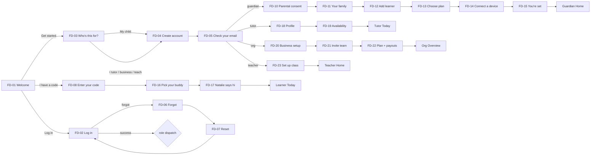

# Front Door & Flow — the connective tissue that was missing
**Doc 38 · Moyo platform pack · Date:** Aug 27, 2026
**Scope:** the production front door — every screen a person can reach from a cold launch until first value, wired to live auth — welcome, log in, sign up by role, verification, forgot/reset, verifiable parental consent, family and learner setup, plan choice, device handoff, role-specific first-run — plus the shared account surfaces (switch profile, session ended, delete account). Web and mobile, both dials (Hot/Cool), both pane states (dual/single), every state (default/loading/error/empty/success/offline).
**Skills applied to write this doc:** user-research · design-critique · ux-copy · accessibility-review · design-handoff · design-system · frontend-design, with Mobbin as the per-screen pattern reference (every reference is a link, not a name).
**Skills the build must run, per screen, in order (binding — see the prompt §2.5 and §11 below):** `/user-research` → `/mobbin-pass` → `frontend-design` → `/design-handoff` → `/design-system` → `/ux-copy` → build → `/accessibility-review` → `/design-critique` → `/code-review`; standing: react-native-community/skills, Callstack react-native-best-practices, Margelo react-native-skills, gauntlet-loop critic if installed. **Provenance:** the slash-named skills are project skills committed at `.claude/skills/` (shipped as `moyo-claude-skills.zip`); `/code-review` is bundled with Claude Code; `frontend-design` is an official-marketplace plugin. None are third-party packages.
**Audit-first (doc 30 §0):** this doc is the target. The build step inventories what exists and marks only genuine additions `[add]`. I cannot read the private repo from this environment — Phase 0 of `prompts/front-door-build.prompt.md` is that inventory.
**Scope unit:** the production release. Nothing here is sized to a milestone that can merely be shown; a screen is done when it works against the live provider on a real device.
**Standing rules that bind this doc:** Zustand only (no bare `useState`/`useReducer`; form state lives in stores so it survives the fold); real photography from Pexels or nothing; parents never see business tiers; a child never types an email or password; no invented APIs — every library seam below cites its doc.

---

## §0 · Why it was missing — and the rule that stops it recurring

Plainly: this was a sequencing mistake in doc 09, and it was mine.

Doc 09 ("screens first") deferred **auth** to Wave 3 and put a **Mock-Session Contract** underneath Wave 2 so screens could be seen without a backend. That was the right instinct for the *wiring* (Better Auth, Stripe, webhooks, COPPA verification vendors). But the contract booted the app *already signed in* as a persona — which silently pushed every **auth screen** out of the visible build along with the wiring. Welcome, log in, sign up, role choice, verification, forgot/reset, consent, family setup, learner handoff, plan: none of it was in a wave anyone could see. Doc 27 then compounded it by sizing the first milestone to a pre-authenticated learner — scoping to what could be *shown* rather than what *ships*. The result is exactly what you saw — a product with no front door and no flow from launch, in a category where the front door is the first thing a parent and an App Store reviewer meet.

Two things are true at once: the *specs* for these screens existed (docs 06, 36, 37), and the *build order* never scheduled them. A spec nobody schedules is a spec nobody builds.

**The rule, effective now (amends doc 09 §3):**

> **Every screen reachable from cold launch ships wired to the live provider, in the same PR train as the screen. Auth screens are screens, and they are not done until they work against Better Auth on a real device.** The `AuthPort` (§9) has one live implementation and one test double; the double serves CI, Storybook, and E2E, is excluded from release bundles, and is never a milestone. There is no "screens now, auth later."

And the scope amendment (amends docs 27 and 33): **the unit of scope is the production release.** Calendar dates are dates; they do not shrink the product. The first release runs from cold launch — Welcome → guardian sign-up with real email verification → parental consent → add learner → plan purchase on the live rail → handoff code → learner redeems on a second device → Today — and every step of that path is covered by §14's production-readiness rows before it is called done.

Whether the screens that *do* exist meet the bar is a separate question I can't answer without seeing them. §11 is the critique protocol the builder runs per screen; send me screenshots (both dials, three widths) or the repo zip and I'll run the same rubric on the real thing.

---

## §1 · The flows — cold launch to first value, per role

**Design law for every flow (research-grounded, §10):**
1. **Value before the wall.** The Welcome screen shows what Moyo is (photo + tagline + one line of what happens) before asking for anything. Login walls and bare "Get started" buttons are the two highest-friction patterns NN/g has measured; both are avoided by design here.
2. **One door per role, one router behind it.** Roles are chosen once at sign-up; returning users never see a picker wall — the session's `activeRole` dispatches (doc 36 §2).
3. **The child's door has no keyboard-typing of credentials.** A learner enters a 6-character code or scans a QR the guardian shows them. Never email, never password.
4. **Every step has a visible exit and a preserved draft.** Back never loses input; the fold never loses input; killing the app mid-signup resumes at the same step.
5. **Errors say what happened, why, and what to do.** No apologies, no codes shown to users, no dead ends.

### 1.1 Guardian (the account holder, the payer)
```
FD-01 Welcome
  → "Get started" → FD-03 Who's this for? [My child]
  → FD-04 Create account (name · email · password · terms)      ← or Apple / Google
  → FD-05 Check your email (6-digit OTP)                          ← skipped for social sign-in
  → FD-10 Parental consent (COPPA verifiable parental consent — method set per doc 06)
  → FD-11 Your family (family name, optional second guardian)
  → FD-12 Add learner (first name · grade → band · avatar) [repeat]
  → FD-13 Choose plan (Family: early bird $11/mo · regular $15.99/mo · 1-month trial)
  → FD-14 Connect a device (code + QR for the learner)            ← skippable: "Do this later"
  → FD-15 You're set → Guardian Home with the "First session" card
```
Total: 7 screens after Welcome, ~3 minutes on the mock. Every screen after FD-04 is resumable.

### 1.2 Learner (a child; a sub-profile, never an account)
```
FD-01 Welcome → "I have a code" → FD-08 Enter your code (6 big cells, letters+digits, or "Scan")
  → FD-16 Pick your buddy (curated avatar set, doc 30 §8.4)
  → FD-17 Natalie says hi (baked greeting clip, doc 32 — skippable after 2s, reduced-motion = still)
  → Learner Today with ONE action: "Snap your homework"
```
Band-adaptive per doc 31/36: K-2 copy is ≤ 6 words per line, targets 56dp, no dense forms.

### 1.3 Tutor (joins an organization, or is a solo practice = org of one `[decision]`)
```
Invite email/link → FD-09 You're invited (org name, who invited, accept)
  → FD-04 Create account (or FD-02 Log in if the email already exists)
  → FD-05 OTP (if email/password)
  → FD-18 Your tutor profile (photo · subjects · grade bands)
  → FD-19 Availability (weekly grid, timezone)
  → Tutor Today
```
No invite → FD-03 [I tutor] → FD-04 → FD-05 → FD-20 Business setup (solo default) → FD-19 → Tutor Today.

### 1.4 Organization owner (tutoring business)
```
FD-01 → FD-03 [I run a tutoring business] → FD-04 → FD-05
  → FD-20 Business setup (name · locations · seats)
  → FD-21 Invite your team (emails; sends FD-09 invites)
  → FD-22 Business plan + payouts (business tiers shown HERE ONLY; Stripe Connect deferrable)
  → Org Overview
```

### 1.5 Teacher (school class)
```
FD-01 → FD-03 [I teach a class] → FD-04 (school email encouraged) → FD-05
  → FD-23 Set up your class (name · grade · roster later) → Teacher Home
```
District (SSO/LTI) stays Phase 3 (doc 36).

### 1.6 Returning user and recovery
```
FD-01 → "Log in" → FD-02 Log in (email+password · Apple · Google · "I have a code")
  → role dispatch (doc 36 §2): 1 role → that shell · n roles → last-used shell
Forgot: FD-02 → FD-06 Forgot password (email) → FD-07 Reset (OTP → then new password; 3-step)
Expired session: any screen → FD-25 Session ended (one tap back in; deep link preserved)
Family device: learner Today → guardian long-press/PIN → FD-24 Switch profile
```

### 1.7 Flow diagram


---

## §2 · Route tree and guards (verified against Expo Router docs)

Three guard states drive the whole front door. `Stack.Protected` redirects to the anchor route when a guard is false, purges history when a guard flips from true to false, and is enforced on deep links — all documented behavior ([Expo Router — Protected routes](https://docs.expo.dev/router/advanced/protected/); [Authentication guide](https://docs.expo.dev/router/advanced/authentication/)).

```
app/
  _layout.tsx                 # Stack.Protected on session.status + onboarding.complete + activeRole
  (public)/
    _layout.tsx
    index.tsx                 # FD-01 Welcome
    login.tsx                 # FD-02
    signup/index.tsx          # FD-03 Who's this for?
    signup/account.tsx        # FD-04 Create account  (?role=guardian|tutor|org|teacher)
    signup/verify.tsx         # FD-05 Check your email
    forgot.tsx                # FD-06
    reset.tsx                 # FD-07
    code.tsx                  # FD-08 Learner code entry
    invite/[token].tsx        # FD-09 Invite landing (public until accepted)
  (onboarding)/               # guard: authed && !onboarding.complete
    _layout.tsx               # step progress header; resumes from onboarding.step
    guardian/consent.tsx      # FD-10
    guardian/family.tsx       # FD-11
    guardian/learner.tsx      # FD-12  (?index=n for repeats)
    guardian/plan.tsx         # FD-13
    guardian/handoff.tsx      # FD-14
    guardian/done.tsx         # FD-15
    learner/avatar.tsx        # FD-16
    learner/hello.tsx         # FD-17
    tutor/profile.tsx         # FD-18
    tutor/availability.tsx    # FD-19
    org/setup.tsx             # FD-20
    org/team.tsx              # FD-21
    org/billing.tsx           # FD-22
    teacher/class.tsx         # FD-23
  (learner)/ (guardian)/ (tutor)/ (org)/ (teacher)/ (district)/   # role shells — doc 36, separate trees
  account/
    switch.tsx                # FD-24 Switch profile (family devices)
    signed-out.tsx            # FD-25 Session ended
    delete.tsx                # FD-26 Delete account
```

Root layout guard sketch (shape only — Phase 0 maps onto the existing session provider from doc 09):
```tsx
const s = useAppSession()                          // doc 09 contract
<Stack screenOptions={{ headerShown: false }}>
  <Stack.Protected guard={s.status === 'anon'}>            <Stack.Screen name="(public)" /></Stack.Protected>
  <Stack.Protected guard={s.status === 'authed' && !s.onboarding.complete}><Stack.Screen name="(onboarding)" /></Stack.Protected>
  <Stack.Protected guard={s.status === 'authed' && s.onboarding.complete && s.activeRole === 'guardian'}><Stack.Screen name="(guardian)" /></Stack.Protected>
  {/* one Protected block per role shell; account/* is inside every authed guard */}
</Stack>
```
`[add]` to the doc 09 session contract (shipped with the live provider, not deferred): `onboarding: { complete: boolean; step: OnboardingStep | null }` and `status: 'loading' | 'authed' | 'anon' | 'expired'`. Deep links captured while `anon` are stored in the session store and replayed after auth (doc 36 §2 — role-mismatched links drop silently).

---

## §3 · Screen inventory

| ID | Screen | Route | Roles | Pane behavior (§4) | Mobbin pattern anchor |
|---|---|---|---|---|---|
| FD-01 | Welcome | `(public)/index` | all | Dual: photo/clip pane + actions pane | [Greenlight](https://mobbin.com/screens/3f22d323-9821-4df2-a4c7-eaf13fec3da7) · [Duolingo ABC](https://mobbin.com/screens/3e07698e-239a-495f-976c-b6959bbc2344) · [Kit](https://mobbin.com/screens/1918717c-4c7a-4e78-bdc2-130fb7dcc317) |
| FD-02 | Log in | `(public)/login` | adults | Dual: brand pane + form | [YNAB](https://mobbin.com/screens/a4f8c7bf-1230-475c-b406-eabee1d970af) · [Ferndesk](https://mobbin.com/screens/2aa257f8-5aa4-4e89-9cf7-32d130bfbf1b) · [Lovable](https://mobbin.com/screens/23a8697b-220b-4ed1-90c8-94b2bbcbef67) |
| FD-03 | Who's this for? | `(public)/signup` | adults | Dual | [Duolingo ABC](https://mobbin.com/screens/48ebe470-8ff4-4b99-82ce-692973f2b550) · [Greenlight](https://mobbin.com/screens/7cdb02d8-d9ef-4b40-af0e-f6503f8f7b21) · [TikTok](https://mobbin.com/screens/3ee374c7-be6d-4996-bdac-c2fa8047b92c) |
| FD-04 | Create account | `(public)/signup/account` | adults | Dual | [Grok](https://mobbin.com/screens/738bef4a-4495-4995-b7aa-76e5d115c18a) · [Buffer](https://mobbin.com/screens/6e6e0c03-bde3-4abb-926d-07db7876465c) |
| FD-05 | Check your email | `(public)/signup/verify` | adults | Dual | [Afterpay](https://mobbin.com/screens/8cf53c44-626f-4f85-84c9-f95a2efbfbe0) · [OpenPhone](https://mobbin.com/screens/f6f93764-9f91-4177-ba8b-d5c78a4b9001) |
| FD-06 | Forgot password | `(public)/forgot` | adults | Dual | [DeepSeek](https://mobbin.com/screens/ae334093-5a25-4a0b-b8a9-255cbd5d0d71) |
| FD-07 | Reset password | `(public)/reset` | adults | Dual | [Afterpay](https://mobbin.com/screens/8cf53c44-626f-4f85-84c9-f95a2efbfbe0) then [Yami](https://mobbin.com/screens/c369c2da-23d0-4a6d-b1be-14aa41dbde73) (split into two steps) |
| FD-08 | Enter your code | `(public)/code` | learner | **Single always** | [Paired](https://mobbin.com/screens/9db90a5d-e0ae-4c48-b3a9-5811753d5eb6) · [Pangea](https://mobbin.com/screens/c8995181-506d-4634-8313-5cac65789ca5) |
| FD-09 | You're invited | `(public)/invite/[token]` | tutor, teacher | Dual | [Quizlet](https://mobbin.com/screens/0f9d1303-5e46-4201-b53d-00ad05cdda0f) |
| FD-10 | Parental consent | `(onboarding)/guardian/consent` | guardian | Dual | [SHEIN attestation](https://mobbin.com/screens/23436048-de93-46db-ac23-68e249437ff6) |
| FD-11 | Your family | `(onboarding)/guardian/family` | guardian | Dual | [Tubi](https://mobbin.com/screens/971433e9-1629-4fbd-bc2a-107ce134d99f) |
| FD-12 | Add learner | `(onboarding)/guardian/learner` | guardian | Dual | [YouTube Kids](https://mobbin.com/screens/0f4e42d0-eb09-4284-852a-f199759ecdbd) · [Spotify Kids](https://mobbin.com/screens/4456d478-9eff-4bfe-8918-2d9e0c3c3f9d) · [Duolingo grade ask](https://mobbin.com/screens/ce101753-63a5-4c96-bf23-33f584d0a4ba) |
| FD-13 | Choose plan | `(onboarding)/guardian/plan` | guardian | Dual | [Deezer](https://mobbin.com/screens/dbd03db7-6406-4715-8edc-0501121ea6fe) · [Apple One](https://mobbin.com/screens/291ed0fb-9696-4ac8-a372-6e66133974f2) |
| FD-14 | Connect a device | `(onboarding)/guardian/handoff` | guardian | Dual | [Paired](https://mobbin.com/screens/9db90a5d-e0ae-4c48-b3a9-5811753d5eb6) · [TikTok link](https://mobbin.com/screens/785dd1f6-3b18-4b09-bf80-82dcdb93ee41) · [Brave timer](https://mobbin.com/screens/53c3fdf5-a622-4484-aa67-8ed340ca85c0) |
| FD-15 | You're set | `(onboarding)/guardian/done` | guardian | Dual | [Forest](https://mobbin.com/screens/d9adf5f8-cf23-4a19-99e6-abb66437cd05) (hero + one CTA) |
| FD-16 | Pick your buddy | `(onboarding)/learner/avatar` | learner | Single | [Spotify Kids](https://mobbin.com/screens/6c69df22-ccd8-4996-9220-e7353a5ccf31) |
| FD-17 | Natalie says hi | `(onboarding)/learner/hello` | learner | Single | [Kit](https://mobbin.com/screens/1918717c-4c7a-4e78-bdc2-130fb7dcc317) |
| FD-18 | Tutor profile | `(onboarding)/tutor/profile` | tutor | Dual | — (form; doc 08 anatomy) |
| FD-19 | Availability | `(onboarding)/tutor/availability` | tutor | Dual | — (reuses the schedule grid already in the starter) |
| FD-20 | Business setup | `(onboarding)/org/setup` | org | Dual | — |
| FD-21 | Invite your team | `(onboarding)/org/team` | org | Dual | [TikTok invite](https://mobbin.com/screens/785dd1f6-3b18-4b09-bf80-82dcdb93ee41) |
| FD-22 | Plan + payouts | `(onboarding)/org/billing` | org | Dual | [YouTube tiers](https://mobbin.com/screens/3cc1cd56-f653-42ca-a4ef-26b0f999b7ed) |
| FD-23 | Set up your class | `(onboarding)/teacher/class` | teacher | Dual | — |
| FD-24 | Switch profile | `account/switch` | family devices | Single sheet | [Spotify Kids](https://mobbin.com/screens/4456d478-9eff-4bfe-8918-2d9e0c3c3f9d) · [HBO kid-proof exit](https://mobbin.com/screens/ffb49833-1f15-408d-abcd-ac664b2daf42) |
| FD-25 | Session ended | `account/signed-out` | all | Single | — |
| FD-26 | Delete account | `account/delete` | adults | Single | — |
| PW-01 | Plan & trial (entry paywall) | = FD-13 (guardian) / FD-22 (org) | guardian, org | Dual | [Deezer](https://mobbin.com/screens/dbd03db7-6406-4715-8edc-0501121ea6fe) · [Vocabulary](https://mobbin.com/screens/32238af5-552f-4ac3-bede-16981f4c23d3) · [Strava](https://mobbin.com/screens/5b6f970d-d70f-4241-a915-b20388efc1aa) |
| PW-02 | Trial ending reminder | `(guardian)/billing/trial-ending` (sheet) | guardian | Single sheet | [Nibble](https://mobbin.com/screens/fb296b02-4eb7-4ecd-926a-077cd88c30b8) · [Bloom](https://mobbin.com/screens/96ed9ff6-b629-4c85-9514-0b1f6b3a6690) |
| PW-03a | Free-limit upgrade (guardian) | `(guardian)/billing/upgrade` (sheet) | guardian | Single sheet | [X](https://mobbin.com/screens/75cb81aa-fece-4712-8091-5bd61675d5cb) · [Savee](https://mobbin.com/screens/7d2af55d-e4f4-486c-a7e2-203a87c63639) · [Grok Bot](https://mobbin.com/screens/f6d13969-a642-445e-80f9-274d96486e9a) |
| PW-03b | Free-limit stop (learner — no prices) | `(learner)/limit` | learner | Single | — (band copy only; §5B) |
| PW-04 | Trial ended / plan lapsed | `(guardian)/billing/lapsed` | guardian | Dual | [Headway](https://mobbin.com/screens/8f29fa3f-1c57-4ba5-9e02-0b47f5db478d) |
| PW-05 | Manage plan | `(guardian)/settings/plan` · `(org)/settings/plan` | guardian, org | Dual | [GoodRx](https://mobbin.com/screens/440942f2-dd10-41d9-9182-362b71f00591) · [Deezer](https://mobbin.com/screens/c075f474-7c8b-4bc1-ba0a-93027321515d) · [OpenPhone](https://mobbin.com/screens/034178d9-071a-49b1-89fe-41d21caab5e0) · [Ahead](https://mobbin.com/screens/f22a1c1c-fda3-4038-b0d1-3a12a3ec8332) |
| PW-06 | Restore purchases (action + result states) | inside PW-01/PW-05 (mobile) | guardian, org | — | [Pillow](https://mobbin.com/screens/73a2cafa-d97e-477b-9e00-1e276ef50151) footer · [Riveo](https://mobbin.com/screens/08106597-8396-46e5-95c7-3bdebc11ee99) |
| PW-07 | Cancel — what happens next | `(guardian)/settings/plan/cancel` | guardian, org | Single | [Rivian](https://mobbin.com/screens/7ac1a087-f6cf-4d5e-be13-07ada99c8182) (policy plainness) |
| PW-08 | Billing (web) | `settings/billing` | guardian, org (web) | Dual | [OpenPhone](https://mobbin.com/screens/034178d9-071a-49b1-89fe-41d21caab5e0) |

26 front-door screens + 8 paywall surfaces = 34. Every one ships with all six states in Storybook (§11) before it counts as done.

---

## §4 · Dual-pane law for the front door

Doc 37 defined `TwoPaneShell` (brand pane + form pane; brand pane never interactive). This section pins the numbers so no screen invents its own.

**Width classes (Material 3 window size classes, already the basis of the local split view):** compact < 600dp · medium 600–839dp · expanded ≥ 840dp. The fold is just a width-class change — no orientation or device-model code anywhere.

| Class | Brand pane | Form pane | Notes |
|---|---|---|---|
| Expanded (≥840) | Left, 5/12 width, full height, photo/clip fills, logo + tagline overlaid bottom-left | Right, 7/12, form column centered, max-width 440dp, vertical center | The "logo + tagline left / form right" brief |
| Medium (600–839) | Collapses to a **header band**, 160dp tall, photo crop + logo | Full width, form column centered, max-width 480dp | Tablet portrait, large phones landscape |
| Compact (<600) | Header band 120dp (96dp when keyboard is up) | Full width, 20dp gutters, keyboard-avoiding | Phones, folded fold |

Rules:
1. **State survives the fold.** All field values, step index, OTP timer, and selected role live in the `signupStore` / `loginStore` (Zustand). The shell re-renders panes; nothing remounts a form with empty inputs.
2. **Brand pane content is a single `BrandPaneContent` variant per screen**, chosen by route: Welcome uses the Natalie baked clip (still frame under reduced motion); Login/Signup use a real-family photo (§5 photo brief); onboarding steps use the role-accent photo set (doc 36 accent system).
3. **Learner screens never dual-pane** (doc 37). FD-08/16/17 are single-pane at every width; on expanded widths the content column is max-width 560dp, centered, larger type.
4. **Focus never lands in the brand pane.** It is `accessible={false}` / `aria-hidden`, and its image has alt text only when it carries meaning (the Welcome hero does; decorative crops do not).
5. **Web keyboard**: Tab order is form-only; Escape closes any sheet opened from the form (password rules, plan details).

---

## §5 · Per-screen specs (handoff format)

Conventions for every screen below:
- **Tokens are named by role** (`space.section`, `type.display`, `target.min`) — Phase 0 maps them to the repo's real token names from the neubrutalist pipeline + doc 08/20 completions. Hardcoded values are a lint failure.
- **Components are named by the local kit first** (`ui/`). Where a component doesn't exist yet it is marked `[add]` and specced in §8.
- **Copy is final unless marked `[alt]`.** Sentence case. Buttons start with a verb. Errors: what happened + why + what to do. No apologies, no error codes shown to users.
- **States** every screen must render in Storybook: `default · loading · error · empty · success · offline`.
- **Motion** uses the two token durations only: `motion.fast` (≈180ms, ease-out) for state changes, `motion.moderate` (≈320ms, ease-in-out) for pane/route transitions. `prefers-reduced-motion` / `AccessibilityInfo.isReduceMotionEnabled` → crossfades only.
- **Targets**: adult surfaces ≥ 48dp; learner surfaces ≥ 56dp (doc 08 age-band target tokens); web pointer ≥ 32px with 8px spacing.

### FD-01 · Welcome
**Job:** say what Moyo is in one glance, and offer three doors — Get started, Log in, I have a code.
**First impression (2s test):** the photo and the tagline. A real child at a kitchen table with homework, natural light, mid-thought — not a stock smile. Logo lockup "Moyo AI", tagline *Learn it by heart.*
**Layout:** §4 dual. Brand pane = Natalie baked greeting clip (doc 32 asset; 4s loop, muted, still frame under reduced motion) *or* the hero photo — **decision: photo on web, clip on mobile** (a clip in a 5/12 pane at desktop reads as an ad). Actions pane: wordmark, tagline, one sentence of value, three actions stacked.
**Copy:**
- Eyebrow (small, above tagline): `Homework help for grades K–12`
- Tagline (display): `Learn it by heart.`
- Body: `Snap a homework problem. Natalie coaches your child through it — step by step, never just the answer.`
- Primary: `Get started`
- Secondary: `Log in`
- Tertiary (outlined, icon: ticket/key): `I have a code` — the learner door; visibly different so a kid finds it.
- Footer: `By continuing you agree to the Terms and Privacy Policy.` (links) · `Made for families and schools in the US.`
**Components:** `TwoPaneShell` · `BrandPaneContent(variant="welcome")` · `Wordmark` · `Button(primary|secondary|outline)` · `LegalFooter`.
**States:** loading = wordmark + skeleton actions for ≤400ms max (never a spinner wall); offline = actions still work (they're local); error = n/a.
**Motion:** the one orchestrated moment of the front door — wordmark fades/rises 120ms, tagline 180ms later, actions 120ms after that; total ≤ 520ms; nothing else on the screen moves after that.
**A11y:** hero image alt `A child working through a math problem at a kitchen table while a parent looks on`; heading order H1 = tagline; three buttons are the only tab stops; "I have a code" has `accessibilityHint="For kids: enter the code from your grown-up"`.
**Mobbin:** photo-hero + two actions — [Greenlight](https://mobbin.com/screens/3f22d323-9821-4df2-a4c7-eaf13fec3da7); third door for kids/classes — [Duolingo ABC](https://mobbin.com/screens/3e07698e-239a-495f-976c-b6959bbc2344); character-peek warmth — [Kit](https://mobbin.com/screens/1918717c-4c7a-4e78-bdc2-130fb7dcc317).
**Photo brief (Pexels, [license](https://www.pexels.com/license/)):** 6–12-year-olds doing homework, kitchen/living room, window light, camera at child eye-level, no branded clothing, no screens facing camera, diverse families, at least one adult present but not the subject. Landscape 3:2 for the pane, portrait 4:5 crop for the mobile band — pick shots that survive both crops (subject in the left third).

### FD-02 · Log in
**Job:** get a returning adult back in, in one screen, with the least typing.
**Layout:** §4 dual. Form column order: heading → social buttons → divider → email → password → forgot link → primary → sign-up link → learner link.
**Copy:**
- H1: `Welcome back`
- Sub: `Log in to your family, tutoring, or school account.`
- Social: `Continue with Apple` · `Continue with Google` (Apple first on iOS, Google first on Android/web)
- Divider: `or`
- Email label: `Email` · placeholder none (labels always visible; placeholders are not labels)
- Password label: `Password` · trailing toggle `Show` / `Hide` (default masked; toggle always present — NN/g's finding is that masking with no way to see the input causes failed logins)
- Link: `Forgot password?`
- Primary: `Log in`
- Below: `New here? Create an account` · `Are you a student? Enter your code`
- "Last used" chip on the social button that succeeded last time (stored in the login store; pattern from [Lovable](https://mobbin.com/screens/23a8697b-220b-4ed1-90c8-94b2bbcbef67)).
**Errors (inline under the field, plus a live-region summary at top of form):**
- Wrong credentials (single generic message, never "which one was wrong"): `That email and password don't match. Check both, or reset your password.`
- Unverified email: `Verify your email first. We sent a new code to {email}.` → routes to FD-05 with `type=email-verification`.
- Too many attempts: `Too many tries. Wait {n} minutes or reset your password.`
- Offline: `You're offline. Reconnect to log in.` (primary disabled, retries automatically on reconnect)
- Social cancelled: no error — return to the form silently.
**Components:** `TwoPaneShell` · `SocialButton(provider)` · `TextField(type=email)` · `PasswordField [add if the kit lacks the toggle variant]` · `InlineError` · `FormErrorSummary [add]` · `Button`.
**States:** loading = primary shows spinner + `Logging in…`, fields disabled, social buttons disabled; success = 200ms check on the button, then route (never a "success" screen).
**Autofill (real RN props):** email `autoComplete="email" textContentType="username" keyboardType="email-address" autoCapitalize="none"`; password `autoComplete="password" textContentType="password" secureTextEntry`. Web: same via `autocomplete` attributes so password managers fill both.
**A11y:** labels bound to inputs; error summary `accessibilityLiveRegion="polite"` / `aria-live="polite"` and receives focus on submit failure; the show/hide toggle is a labeled button (`Show password`) not an icon-only control; Enter submits on web.
**Mobbin:** brand+tagline left, card form right — [YNAB](https://mobbin.com/screens/a4f8c7bf-1230-475c-b406-eabee1d970af); art pane — [Ferndesk](https://mobbin.com/screens/2aa257f8-5aa4-4e89-9cf7-32d130bfbf1b); social-first with last-used — [Lovable](https://mobbin.com/screens/23a8697b-220b-4ed1-90c8-94b2bbcbef67).

### FD-03 · Who's this for?
**Job:** route the person to the right account type without making it feel like a form.
**Layout:** dual; form pane shows 4 `RoleChoiceCard`s (§8) in a single column (2×2 on expanded), radio semantics, one `Continue`.
**Copy:**
- H1: `Who's this for?`
- Sub: `This sets up the right kind of account. You can add more later.`
- Cards (title / support):
  1. `My child` / `I'm a parent or guardian setting up Moyo for kids at home.`
  2. `My students` / `I teach a class and want to use Moyo at school.`
  3. `My tutoring business` / `I run a tutoring company and manage tutors and clients.`
  4. `Me — I tutor` / `I'm a tutor joining a business, or working on my own.` `[decision: solo tutor = organization of one]`
- Primary: `Continue`
- Under the cards, small: `Kids don't sign up here — a grown-up sets them up and gives them a code.` (the sentence that prevents a 9-year-old from creating an adult account)
**States:** `Continue` disabled until a card is selected (with `accessibilityState={{disabled:true}}` and a hint: `Pick one to continue`); no loading state (client-only); the choice is written to `signupStore.role` immediately.
**A11y:** cards are a `radiogroup`; arrow keys move selection on web; each card ≥ 72dp tall; selection shown by border + check icon + text weight (never color alone).
**Mobbin:** two-role question with explanatory subtext — [Duolingo ABC](https://mobbin.com/screens/48ebe470-8ff4-4b99-82ce-692973f2b550); parent/child role with price transparency — [Greenlight](https://mobbin.com/screens/7cdb02d8-d9ef-4b40-af0e-f6503f8f7b21); illustrated pair — [TikTok](https://mobbin.com/screens/3ee374c7-be6d-4996-bdac-c2fa8047b92c). (Not the 6-card grid — [Canva](https://mobbin.com/screens/48261957-4520-4048-9b13-d14a95600c2f) — four is the ceiling for a first decision.)

### FD-04 · Create account
**Job:** one screen, four fields, done. Social sign-in first, email second.
**Copy:**
- H1 varies by role: guardian `Create your family account` · teacher `Create your teacher account` · org `Create your business account` · tutor `Create your tutor account`
- Sub: `Use the email you check most — that's where session reports go.` (guardian) / `Use your school email if you have one.` (teacher)
- Social buttons as FD-02, then `or`
- `Your name` (first + last in one field; we don't split names) · `Email` · `Password`
- Password rule line (always visible, updates live, not a red wall): `At least 8 characters. Longer is stronger.` → on meet: `Good password.`
- Consent checkbox (adults): `I agree to the Terms and Privacy Policy, and I'm 18 or older.`
- Primary: `Create account`
- Below: `Already have an account? Log in`
**Errors:**
- Email taken: `An account with {email} already exists. Log in, or reset your password.` (links) — user enumeration is accepted here because sign-up must tell the truth; the *forgot* flow is the one that stays generic.
- Weak password: inline rule line turns to error tone: `Add {n} more characters.`
- Invalid email: `Enter a valid email, like name@example.com.`
- Network: `Couldn't create your account. Check your connection and try again.` (form stays filled)
**Components:** `TwoPaneShell` · `SocialButton` · `TextField` · `PasswordField` · `PasswordRules [add]` · `Checkbox` · `Button` · `FormErrorSummary`.
**Autofill:** name `autoComplete="name" textContentType="name"`; email as FD-02; password `autoComplete="new-password" textContentType="newPassword"` so iOS offers a strong password.
**A11y:** rule line is `aria-describedby` of the password field; checkbox label is the tap target; keyboard-avoiding scroll keeps the active field and the primary button visible.
**Mobbin:** minimal email form with forgot inline — [Grok](https://mobbin.com/screens/738bef4a-4495-4995-b7aa-76e5d115c18a); form left, brand right — [Buffer](https://mobbin.com/screens/6e6e0c03-bde3-4abb-926d-07db7876465c).

### FD-05 · Check your email (OTP)
**Job:** verify the email with a 6-digit code without leaving the app.
**Copy:**
- H1: `Check your email`
- Sub: `Enter the 6-digit code we sent to {email}.` · link `Wrong email? Change it`
- `OtpField` (§8) — six cells, auto-advance, paste-from-clipboard, iOS `textContentType="oneTimeCode"` / `autoComplete="one-time-code"` so mail-app codes autofill
- Resend: `Resend code` → disabled with countdown `Resend in 0:{ss}` (30s), then active; after 3 resends: `Need help? Contact support`
- Primary: `Continue` — enabled only when six digits are present; auto-submits on the sixth digit (with the button still present for screen-reader users)
**Errors:** wrong: `That code isn't right. Check the newest email — older codes stop working.` · expired: `That code expired. We sent a new one.` (auto-resend once) · too many: `Too many tries. Wait {n} minutes.`
**States:** loading = cells locked, primary spinner; success = cells fill green for 200ms then route (guardian → FD-10, teacher → FD-23, org → FD-20, tutor → FD-18 or invite acceptance).
**A11y:** each cell announces `Digit {n} of 6`; the group has `accessibilityLabel="Verification code"`; on error, focus returns to cell 1 with the message announced; the countdown text is `aria-live="off"` (no per-second announcements) and the button's label carries the state.
**Mobbin:** six boxes + resend — [Afterpay](https://mobbin.com/screens/8cf53c44-626f-4f85-84c9-f95a2efbfbe0); dots + timed resend + disabled CTA — [OpenPhone](https://mobbin.com/screens/f6f93764-9f91-4177-ba8b-d5c78a4b9001).

### FD-06 · Forgot password → FD-07 · Reset password (3-step)
**Why three steps, not two:** Better Auth's email-OTP plugin exposes `checkVerificationOtp()` so the code can be validated *before* the person types a new password ([Email OTP plugin docs](https://better-auth.com/docs/plugins/email-otp)). Asking for the new password on the same screen as the code ([Yami](https://mobbin.com/screens/c369c2da-23d0-4a6d-b1be-14aa41dbde73), [Weverse](https://mobbin.com/screens/180def6d-3c73-4ebc-a9d5-a6c780de778c)) makes a wrong code throw away a good password.
**FD-06 copy:** H1 `Forgot your password?` · sub `Enter your email and we'll send a 6-digit code.` · `Email` · primary `Send code` · back link `Back to log in`. **Response is always the same** regardless of whether the email exists: `If {email} has an account, a code is on its way.` (prevents account enumeration — the plugin masks this on the current endpoint; the build verifies the client calls `/email-otp/send-verification-otp`, not the legacy path).
**FD-07 step A:** identical to FD-05 with H1 `Enter your code`. **Step B:** H1 `Choose a new password` · `New password` (rules line as FD-04) · `Confirm password` (hidden until the first field is valid — progressive disclosure) · checkbox `Log out of all other devices` (default on) · primary `Save password` → success: `Password saved. Log in with your new password.` → FD-02 with email prefilled.
**Mobbin:** [DeepSeek](https://mobbin.com/screens/ae334093-5a25-4a0b-b8a9-255cbd5d0d71) (email + code with inline resend timer, for FD-06 tone).

### FD-08 · Enter your code (learner)
**Job:** a 6-year-old, holding a phone, gets in without reading much.
**Layout:** single pane always. Natalie still-frame small at top (not the clip — it competes with the task), H1, six big cells, one giant button, one small "Scan instead" button. Nothing else. Type scale one step up from adult; K-2 band per doc 31.
**Copy (K-2 band; ≤ 6 words/line):**
- H1: `Type your code`
- Sub: `Ask your grown-up for it.`
- Cells: 6 characters, uppercase letters + digits, `AAA-000` grouping with a visual dash (the code format from FD-14; letters exclude I/O/1/0 so nothing is confusable)
- Primary: `Let's go`
- Secondary (icon camera): `Scan instead`
- Link (tiny, bottom): `I'm a grown-up` → FD-02
**Errors (read aloud by Natalie's voice? No — doc 32 keeps voice for lessons. Text only, big):** wrong: `That code didn't work. Try again.` · expired: `Ask your grown-up for a new code.` · offline: `Turn on Wi-Fi to start.` (with a picture)
**States:** cells 64dp tall; on success the cells bounce once (120ms, reduced-motion = none) and route to FD-16.
**A11y:** cells ≥ 56dp targets; announces `Letter {n} of 6`; no auto-submit for learners (a mis-tap shouldn't submit) — the button is the commit; contrast 7:1 on cell text (kids' screens use the AAA target, doc 08).
**Mobbin:** 6-cell letter code with dash — [Paired](https://mobbin.com/screens/9db90a5d-e0ae-4c48-b3a9-5811753d5eb6); big code entry + keypad — [Pangea](https://mobbin.com/screens/c8995181-506d-4634-8313-5cac65789ca5); "sign in manually" fallback — [Skype](https://mobbin.com/screens/fc6fce8d-a2a1-4a6f-bbc6-9cd1836a2d2f).

### FD-09 · You're invited
**Copy:** eyebrow `{Org name}` · H1 `{Inviter first name} invited you to tutor with {Org name}` · body `Accept to set up your tutor profile. It takes about two minutes.` · primary `Accept and continue` · secondary `Not you? Ignore this invite`. Expired token: `This invite expired. Ask {inviter} to send a new one.` (no dead end: `Log in` link stays).
**Mobbin:** join-by-invite framing — [Quizlet](https://mobbin.com/screens/0f9d1303-5e46-4201-b53d-00ad05cdda0f).

### FD-10 · Parental consent (COPPA verifiable parental consent)
**Job:** meet the legal bar without making a parent feel investigated.
**Law:** children under 13 → COPPA requires verifiable parental consent before collecting personal information from the child ([FTC — COPPA rule](https://www.ftc.gov/legal-library/browse/rules/childrens-online-privacy-protection-rule-coppa); [FTC — COPPA FAQs](https://www.ftc.gov/business-guidance/resources/complying-coppa-frequently-asked-questions)). Method set is doc 06's verified list; this screen renders whichever methods doc 06 enabled. The mock adapter simulates the text-plus path.
**Copy:**
- H1: `One more step to protect your child`
- Body: `US law (COPPA) asks us to confirm you're the parent or guardian before Moyo collects anything about a child under 13. Here's what we collect and why:` → three plain rows: `First name and grade — to pick the right level` · `Homework photos and chat — so Natalie can help; deleted on your schedule` · `Progress — so you can see it in session reports`. Link: `Read the full Children's Privacy Notice`
- Method chooser (`ConsentCheckpoint` §8): each method is a card with what it needs and how long it takes.
- Attestation checkbox: `I'm this child's parent or legal guardian, and I consent.`
- Primary: `Confirm and continue` · secondary: `Do this later` **only if** doc 06 allows a consent-pending state (learner cannot start sessions until confirmed — the guardian home shows the pending card).
**Errors:** method failed: `We couldn't confirm that. Try another method, or contact support — your setup is saved.`
**A11y:** the three rows are a list, not a paragraph; the notice link opens in-app (sheet on mobile, dialog on web) and returns focus to the link.
**Mobbin:** guardian attestation copy — [SHEIN](https://mobbin.com/screens/23436048-de93-46db-ac23-68e249437ff6).

### FD-11 · Your family
**Copy:** H1 `Name your family` · sub `This is what your kids will see.` · `Family name` (prefilled `The {Last name}s`) · optional `Add another parent or guardian` (email; sends an invite) · primary `Continue`. Empty second-guardian is fine; no error.
**Mobbin:** adult-account-manages-kid framing — [Tubi](https://mobbin.com/screens/971433e9-1629-4fbd-bc2a-107ce134d99f).

### FD-12 · Add learner
**Job:** the child's profile in under 30 seconds, with the grade → band mapping made visible.
**Copy:**
- H1: first learner `Who's learning?` · subsequent `Add another learner`
- `First name` (only — no last name, no birthdate; grade is enough for band and keeps the child's data minimal)
- `Grade` — segmented picker K · 1 · 2 … 12 (not a dropdown); under it, live: `Natalie will use the {K–2 | 3–5 | 6–8 | 9–12} voice: {one-line description from doc 31}`
- Optional: `Reads at a different level?` → reveals `readsAt` grade (doc 36)
- `Pick an avatar` — curated set from doc 30 §8.4, 8 visible + `More`; never a photo of the child
- Primary: `Add {name}` → then a choice sheet: `Add another learner` / `Continue`
**Errors:** empty name: `Enter a first name.` · duplicate name in family: `You already have a {name}. Add a nickname so they're easy to tell apart.`
**A11y:** grade picker is a `radiogroup` with 13 options, arrow keys on web, each ≥ 48dp; avatar grid announces each item by name (`Fox`, `Rocket`…), selection by check icon + label.
**Mobbin:** name + age + avatar — [YouTube Kids](https://mobbin.com/screens/0f4e42d0-eb09-4284-852a-f199759ecdbd); mascot asks the grade — [Duolingo](https://mobbin.com/screens/ce101753-63a5-4c96-bf23-33f584d0a4ba); age-band choice with "help me choose" — [Spotify Kids](https://mobbin.com/screens/6c69df22-ccd8-4996-9220-e7353a5ccf31).

### FD-13 · Choose plan (family only)
**Law (doc 05):** parents see **Family** only; business tiers are never rendered on a guardian route (the plan query is role-scoped server-side, and the component takes a `tier[]` prop that the guardian route can only fill with family tiers — the visibility matrix test covers it).
**Copy:**
- H1: `Start your free month`
- Reassurance card (top, before prices — the Deezer move): `We'll remind you 3 days before your trial ends. Cancel anytime in one tap.`
- `PlanCard` Family — Early bird: `$11/mo after your free month` badge `Early-bird price — locked in as long as you stay` ; Regular `$15.99/mo` (shown only when early bird has ended; the screen never shows both)
- Includes list (3 items, plain): `Up to 4 learners` · `Unlimited homework help` · `Session reports for you`
- Primary: `Start free month` · secondary: `Maybe later` → continues with a free-tier session (doc 05 rules) and the trial card stays on Guardian Home
- Legal line: `Billed after your free month. Cancel anytime.` + platform-required terms links.
**Rails:** mobile = RevenueCat/StoreKit/Play (the Shipaton rail); web = Stripe via the Better Auth Stripe plugin (doc 05/06). The screen is the paywall surface for both; only the purchase adapter differs. The mock adapter resolves `startTrial()` after 900ms.
**Errors:** purchase cancelled = silent return; failed: `Payment didn't go through. Nothing was charged. Try another method or skip for now.`
**A11y:** price + period read as one unit (`11 dollars per month after your free month`); the badge is text, not just color; `Maybe later` is a real button, not a low-contrast link.
**Mobbin:** stress-free trial reassurance — [Deezer](https://mobbin.com/screens/dbd03db7-6406-4715-8edc-0501121ea6fe); clean two-tier trial — [Apple One](https://mobbin.com/screens/291ed0fb-9696-4ac8-a372-6e66133974f2).

### FD-14 · Connect a device
**Job:** get the learner onto their own device without typing anything a child can't.
**Copy:**
- H1: `Connect {name}'s device`
- Body: `Open Moyo on {name}'s tablet or phone, tap "I have a code", and enter this:`
- Code display: `{ABC}-{123}` in display type, `Copy` button, `Share` (system share sheet with a prewritten message)
- `Or scan` toggle → QR (the code embedded; the same 6-char code appears under the QR so it works either way)
- Validity: `This code works for 24 hours and for {name} only.`
- Primary: `Done` · secondary: `Do this later` (the code stays on the learner's card in Guardian Home)
- Live status: the screen subscribes to the learner-linked event over the pack's realtime layer (polling every 3s is the fallback when the socket is unavailable) and updates in place: `{name} is connected 🎉`. The test double emits the same event through `fixtures.emitLearnerConnected(learnerId)` — Storybook and E2E only.
**A11y:** the code is a single text node (`A B C, 1 2 3` with spacing via `accessibilityLabel`) so screen readers read it character by character; QR has alt `QR code containing the same code`.
**Mobbin:** letter code with copy + share — [Paired](https://mobbin.com/screens/9db90a5d-e0ae-4c48-b3a9-5811753d5eb6); QR + invite alternative — [TikTok](https://mobbin.com/screens/785dd1f6-3b18-4b09-bf80-82dcdb93ee41); validity timer — [Brave](https://mobbin.com/screens/53c3fdf5-a622-4484-aa67-8ed340ca85c0).

### FD-15 · You're set
**Copy:** H1 `You're set, {first name}.` · body `{Learner}'s first session is one photo away. Here's what to expect:` · three rows: `Snap` `Coach` `Report` (icons, one line each) · primary `Go to your family` → Guardian Home with the "First session" card. Hero: photo-register image, role-accent. No confetti (doc 34 praise law: effort moments only).
**Mobbin:** hero + single CTA — [Forest](https://mobbin.com/screens/d9adf5f8-cf23-4a19-99e6-abb66437cd05).

### FD-16 · Pick your buddy (learner) · FD-17 · Natalie says hi
**FD-16 copy (K-2):** H1 `Pick your buddy` · grid of the curated avatars (64dp each, 3 per row on phones) · primary `That's me!`. Pre-selects the avatar the guardian chose; the child can change it.
**FD-17:** full-bleed Natalie baked greeting (doc 32 clip; captions on by default; still + text under reduced motion): `Hi {name}! I'm Natalie. Show me your homework and we'll figure it out together.` · primary `Let's start` (appears after 2s, or immediately under reduced motion) → Learner Today.
**A11y:** captions are real text, not burned in; the clip has a pause button (WCAG 2.2.2); autoplay is muted until the learner taps (platform rule).
**Mobbin:** age-band picker — [Spotify Kids](https://mobbin.com/screens/6c69df22-ccd8-4996-9220-e7353a5ccf31); character reveal — [Kit](https://mobbin.com/screens/1918717c-4c7a-4e78-bdc2-130fb7dcc317).

### FD-18 → FD-23 · Tutor, org, teacher first-run (compact specs)
| ID | H1 | Fields / content | Primary | Notes |
|---|---|---|---|---|
| FD-18 Tutor profile | `Set up your tutor profile` | photo (optional, real photo only) · subjects (chips) · grade bands (chips) · short bio (140) | `Continue` | Bio counter visible; chips ≥ 44dp |
| FD-19 Availability | `When can you tutor?` | weekly grid (reuse the starter's resource-major schedule component in "availability" mode) · timezone (auto, editable) | `Save availability` | Drag on web, tap-to-toggle on mobile; empty grid is valid with a warning card |
| FD-20 Business setup | `Set up your business` | business name · location(s) · seat count (solo default 1) | `Continue` | Solo tutor path lands here with `solo=true` and skips FD-21 |
| FD-21 Invite your team | `Invite your tutors` | email list (chips, paste-many) · role per invitee (tutor/admin) | `Send invites` / `Skip for now` | Sends FD-09 |
| FD-22 Plan + payouts | `Choose a business plan` | business tiers (doc 05) · `Connect payouts with Stripe` (deferrable) | `Start trial` | The ONLY route that renders business tiers; role-guarded |
| FD-23 Set up your class | `Set up your class` | class name · grade · school (optional) · roster: `Add students later` | `Create class` | Students join via class code (same `LearnerCodeEntry` on FD-08) |

### FD-24 · Switch profile · FD-25 · Session ended · FD-26 · Delete account
- **FD-24** (family device): sheet with each learner's avatar + name, plus a locked `Grown-ups` row (PIN or biometric) → guardian shell. Kid-proof: no way to reach guardian surfaces without the PIN ([HBO Max kid-proof exit](https://mobbin.com/screens/ffb49833-1f15-408d-abcd-ac664b2daf42)). Copy: `Who's here?` · `Grown-ups`.
- **FD-25**: H1 `You've been logged out` · body `Your session ended to keep your account safe. Log back in to pick up where you left off.` · primary `Log in` (deep link preserved). Never lands a learner here — a learner device re-shows FD-08 with the guardian's card pre-known: `Ask your grown-up to connect this device again.`
- **FD-26**: H1 `Delete your account` · consequence list (`Learner profiles, homework photos, and reports are deleted within 30 days` etc. per doc 07 retention) · type-to-confirm `DELETE` · primary `Delete account` (destructive tone) · secondary `Keep my account`. Learner profiles are deleted individually from Guardian settings, not here.

### §5B · Paywall system (PW-01 → PW-08)

**Why it's in this doc:** a paywall is a door. The entry paywall (FD-13/FD-22) is only the first of the gates a paying parent meets; a production app needs the reminder, the lapse, the free-limit stop, manage/cancel/restore, and the web billing surface — designed as one system, or they get bolted on one at a time and read like it.

**Rails and truth (doc 05 owns pricing and tiers; this section owns the surfaces):**
- **Mobile:** RevenueCat over StoreKit/Play — `react-native-purchases` for offerings, purchase, restore, and customer info; `react-native-purchases-ui` for the **Customer Center** (`RevenueCatUI.presentCustomerCenter()`) which handles store-side cancel, refund requests, and restore natively ([react-native-purchases-ui on npm](https://www.npmjs.com/package/react-native-purchases-ui); [source `index.tsx`](https://github.com/RevenueCat/react-native-purchases/blob/main/react-native-purchases-ui/src/index.tsx); [RevenueCat docs](https://www.revenuecat.com/docs); [Expo + RevenueCat guide](https://expo.dev/blog/expo-revenuecat-in-app-purchase-tutorial)). `presentPaywall()` / `presentPaywallIfNeeded({ requiredEntitlementIdentifier })` exist and are the **fallback only** — Moyo's paywall screens are Moyo-designed (tokens, role-scoped tiers, the copy system) with RevenueCat as the purchase and entitlement engine. `[decision]` Paywall Builder templates are not used unless design parity can be shown.
- **Web:** Stripe via the Better Auth Stripe plugin (doc 05/06) — upgrade, list, cancel, restore, and the billing-portal session for card/invoice management (method names verified against the installed `.d.ts`, per doc 06's register).
- **Truth:** entitlement state comes from the server (RevenueCat webhooks → Payload; Stripe webhooks → Payload). Screens *read* `entitlement`; they never derive it from a purchase result alone. One entitlement identifier per tier (`family`, `business_*`), mirrored across both rails.

**Entitlement state → surface (the state machine every PW screen reads):**
| `entitlement.status` | Guardian sees | Learner sees |
|---|---|---|
| `none` (free tier, doc 05) | Free-tier limits; PW-03a when a limit is hit; PW-01 reachable from Settings and the Home card | Free-tier limits; PW-03b when a limit is hit — **no prices, ever** |
| `trialing` | Home card "Free month ends {date}"; PW-02 at T−3 days (push + in-app + email) | Nothing |
| `active` | PW-05 in Settings; nothing else | Nothing |
| `past_due` / grace period | Non-blocking banner "Payment issue — update your card by {date}" → PW-05; access continues through the store/Stripe grace window | Nothing |
| `canceled` (until period end) | PW-05 shows "Ends {date} · Resume"; no nagging | Nothing |
| `expired` | PW-04 once (dismissable to free tier); then free-tier state | Free-tier state |

**PW-01 · Plan & trial** — FD-13 as specced (guardian: Family only) and FD-22 (org: business tiers only). Store-required elements on mobile, all present on the screen, not behind a link: price, billing period, trial length, auto-renewal sentence, **Restore purchases** (PW-06), Terms of Use and Privacy links ([App Store Review Guidelines](https://developer.apple.com/app-store/review/guidelines/) §3.1.2; [Google Play policies](https://play.google.com/about/developer-content-policy/)). Copy (mobile auto-renew line): `Renews monthly at $11 after your free month unless you cancel at least 24 hours before it ends. Manage or cancel in {App Store | Google Play} settings.` Web line: `Renews monthly at $11 after your free month. Cancel anytime from Billing.` Mobbin structural moves: the trial *timeline* (today → reminder → charge) above the price — [Vocabulary](https://mobbin.com/screens/32238af5-552f-4ac3-bede-16981f4c23d3), [Strava](https://mobbin.com/screens/5b6f970d-d70f-4241-a915-b20388efc1aa), [Pillow](https://mobbin.com/screens/73a2cafa-d97e-477b-9e00-1e276ef50151); the reminder toggle — [Vocabulary](https://mobbin.com/screens/32238af5-552f-4ac3-bede-16981f4c23d3); explicit "Cancel anytime, no fees" — [Duolingo](https://mobbin.com/screens/4340cb2e-c140-4b89-a7b3-2ff3cf0957d0). Anti-pattern to avoid: the wall of badges and ratings ([Bloom](https://mobbin.com/screens/96ed9ff6-b629-4c85-9514-0b1f6b3a6690)) — Moyo earns trust with the reminder promise and plain price, not social proof.

**PW-02 · Trial ending reminder** — sheet from the Home card, T−3 days. H1 `Your free month ends {weekday, date}` · body `After that it's $11/mo. Keep going, or cancel — either way, {learner}'s progress stays.` · primary `Keep Moyo` (dismisses; nothing to buy — the subscription already renews) · secondary `Cancel my trial` → PW-07 · tertiary `Remind me the day before`. This is the promise made on FD-13, kept. Push + email carry the same date. Mobbin: the reminder-date confirmation — [Nibble](https://mobbin.com/screens/fb296b02-4eb7-4ecd-926a-077cd88c30b8).

**PW-03a · Free-limit upgrade (guardian)** — bottom sheet, triggered by the doc 05 limit event (the exact limit is doc 05's `[verify]`). H1 `{Learner} used this week's free sessions` · body `Family unlocks unlimited sessions for up to 4 learners, plus session reports.` · price line with trial if eligible (`Start free month` / `Upgrade — $11/mo`) · secondary `Not now` (never disabled, never smaller than 44dp, never grey-on-grey). One list, ≤ 4 benefits, no countdown timers, no "limited offer." Mobbin: single-reason sheet — [X](https://mobbin.com/screens/75cb81aa-fece-4712-8091-5bd61675d5cb); benefit list with restore + disclosure in the same sheet — [Grok Bot](https://mobbin.com/screens/f6d13969-a642-445e-80f9-274d96486e9a); "You discovered a Pro feature" framing — [Savee](https://mobbin.com/screens/7d2af55d-e4f4-486c-a7e2-203a87c63639).

**PW-03b · Free-limit stop (learner)** — full screen, single pane, band copy, **no prices, no purchase controls, no store links** (a child is never shown a purchase prompt). K-2: H1 `All done for this week!` · body `Ask your grown-up to unlock more.` · primary `Show my grown-up` → parent gate (PIN/biometric, doc 07) → PW-03a on the same device · secondary `Back to Today`. 6–8 and 9–12 bands adjust register per doc 31. The guardian also gets a push: `{Learner} hit this week's free limit.`

**PW-04 · Trial ended / plan lapsed** — shown once on the guardian's next open after `expired`. H1 `Your free month is over` · body `Moyo is still here on the free plan — {n} sessions a week. Want unlimited back?` · a three-row "what changes" list (the Headway structure, phrased as what returns, not what's lost: `Unlimited sessions` · `Up to 4 learners` · `Session reports`) · primary `Restart Family — $11/mo` (early-bird price if still eligible; otherwise $15.99) · secondary `Stay on free` (dismisses for good; PW-01 stays reachable in Settings). Mobbin: [Headway](https://mobbin.com/screens/8f29fa3f-1c57-4ba5-9e02-0b47f5db478d).

**PW-05 · Manage plan** — Settings → Plan. Rows: current plan + price · `Next payment {date}` (or `Ends {date}` when canceled, or `Free month ends {date}` when trialing) · payment method (`App Store` / `Google Play` / `Visa •••• 4417` — last four only) · `Change plan` (Family ↔ business never; family early-bird lock explained) · `Cancel plan` → PW-07 · `Restore purchases` (mobile, PW-06) · `Billing history` (web → PW-08; mobile → Customer Center) · learner seats used (`3 of 4`). Mobile management actions open **Customer Center** (`presentCustomerCenter()`) because store subscriptions are managed by the store; Moyo's screen is the truthful summary around it. Mobbin: plan + next date + change/cancel as primary rows — [GoodRx](https://mobbin.com/screens/440942f2-dd10-41d9-9182-362b71f00591), [Deezer](https://mobbin.com/screens/c075f474-7c8b-4bc1-ba0a-93027321515d); restore as a first-class row — [OpenPhone](https://mobbin.com/screens/034178d9-071a-49b1-89fe-41d21caab5e0), [Ahead](https://mobbin.com/screens/f22a1c1c-fda3-4038-b0d1-3a12a3ec8332).

**PW-06 · Restore purchases** — a button present on PW-01 and PW-05 on mobile (store requirement). States: loading `Checking your purchases…` · restored `Family plan restored.` (entitlement re-read from server, screen updates) · nothing found `No purchases to restore for this {Apple ID | Google account}.` · error `Couldn't reach {App Store | Google Play}. Try again in a moment.`

**PW-07 · Cancel — what happens next** — one screen, no guilt loop, no multi-step retention maze. H1 `Cancel Family plan?` · body `You'll keep everything until {date}. After that, Moyo switches to the free plan — {learner}'s progress and reports stay.` · optional one-tap reason (5 chips, skippable) · primary `Cancel plan` (destructive tone) → mobile: opens Customer Center / store management; web: Stripe cancel-at-period-end · secondary `Keep my plan`. Confirmation: `Canceled. You have Family until {date}.` No re-offer on this screen; PW-04 handles the return conversation once, later. Mobbin: plain cancellation policy in the open — [Rivian](https://mobbin.com/screens/7ac1a087-f6cf-4d5e-be13-07ada99c8182).

**PW-08 · Billing (web)** — `settings/billing` for guardian and org: plan card, next payment, payment method, invoices list (PDF), `Manage billing` → Stripe billing portal, `Cancel` → PW-07. Org additionally: seats, per-seat total, payout status (Stripe Connect, doc 05).

**Paywall a11y and law additions:** prices are read as full phrases; the auto-renew sentence is real text near the primary button (not a footnote); `Not now` / `Stay on free` are real buttons with full contrast; no timers, no fake scarcity, no pre-checked upsells; learner surfaces contain no purchase language at all.

**Paywall events (extends §14.4):** `pw.view{surface}`, `pw.cta{surface, action}`, `pw.purchase{tier, rail, result}`, `pw.restore{result}`, `pw.cancel{reason?}` — no PII, no prices in event payloads (prices come from the catalog).

---

## §6 · Copy system for the front door

**Voice.** Warm, plain, specific. Moyo talks like a good teacher at pickup: clear about what happens next, never salesy, never cute at the parent's expense. Sentence case everywhere. Contractions yes. Exclamation marks only in learner-band copy and only once per screen.

**Glossary (one term per thing, everywhere — including the code):**
| Say | Never | Why |
|---|---|---|
| Log in / Log out | Sign in / Login (noun) / Sign out | One verb pair; "Login" as a noun only in URLs |
| Create account | Sign up / Register | Verb + object; matches the button to the outcome |
| Learner | Student / kid / child (in UI) | Neutral across home and school; "child" only in legal/consent copy |
| Grown-up | Parent (in learner-band UI) | A caregiver may not be a parent |
| Guardian | Parent (in adult UI) | Legal accuracy; "parent or guardian" in consent copy |
| Code | Link code / pairing code / PIN | One word a 6-year-old can hold |
| Session | Lesson / chat | Doc 34's unit of reporting |
| Natalie | The tutor / the AI / the assistant | She has a name; the product never says "AI" to a child |

**Error taxonomy (structure: what happened · why · what to do):**
| Class | Pattern | Example |
|---|---|---|
| Validation | field-level, immediate on blur, never on keystroke | `Enter a valid email, like name@example.com.` |
| Auth | generic where enumeration matters, specific where it doesn't | `That email and password don't match.` vs `An account with {email} already exists.` |
| Rate limit | give the wait, give the alternative | `Too many tries. Wait 5 minutes or reset your password.` |
| Network | name the cause, keep the input | `You're offline. Reconnect to continue — your answers are saved.` |
| Server | never expose codes; promise the state | `Something went wrong on our side. Nothing was lost — try again in a moment.` |
| Child-facing | ≤ 6 words, one instruction, picture if possible | `That code didn't work. Try again.` |

**Empty states in the flow:** none of the front-door screens are ever empty except FD-19 (`No hours yet. Tap the days you can tutor.`) and FD-21 (`No invites yet. Add an email to start.`).

**Localization notes (i18n is in scope):** keep buttons ≤ 20 characters in English (German expands ~30%); the code format `AAA-000` is locale-neutral; never concatenate names into sentences without ICU messages (`{name}'s device` needs a possessive rule per locale); dates/times on FD-19 use the device locale.

---

## §7 · Accessibility law for the front door (WCAG 2.2 AA + kids overrides)

| Area | Requirement | How it's met here |
|---|---|---|
| Contrast (1.4.3 / 1.4.11) | 4.5:1 body, 3:1 large text and UI edges | Neubrutalist borders give edges 3:1 free; both dials verified in Storybook with the contrast addon; learner screens use 7:1 (AAA) for text |
| Targets (2.5.8 min; HIG 44pt; Material 48dp) | adult ≥ 48dp, learner ≥ 56dp, web pointer ≥ 32px + 8px gap | doc 08 target tokens; lint rule flags any pressable under the token |
| Labels (3.3.2) | every input has a visible label bound to it; placeholders are never labels | `TextField` requires `label` — lint |
| Errors (3.3.1 / 3.3.3) | identify the field, describe the fix, announce it | `InlineError` + `FormErrorSummary` with `aria-live="polite"` / `accessibilityLiveRegion="polite"`; focus moves to the summary on submit failure |
| Focus (2.4.3 / 2.4.7 / 2.4.11) | logical order, visible indicator, not obscured by the keyboard | brand pane excluded from tab order; focus ring uses the neubrutalist offset outline (visible on both dials); keyboard-avoiding scroll keeps focus visible |
| Keyboard (2.1.1 / 2.1.2) | everything operable; no traps | sheets/dialogs trap focus *inside* and return it on close; Escape closes |
| Names/roles (4.1.2) | radiogroups for role and grade; buttons are buttons | `RoleChoiceCard`, grade picker, avatar grid expose `radio` roles with `checked` state |
| Motion (2.3.3) | reduce motion respected | every animation reads the OS setting; clips become stills; Welcome sequence becomes a crossfade |
| Media (1.2.2 / 2.2.2) | captions; pause control; no autoplay audio | FD-17 captions on by default, pause button, muted until tap |
| Timing (2.2.1) | OTP resend timer and code validity aren't user-blocking time limits | the form never expires; only the *code* does, and resend is one tap |
| Zoom (1.4.4 / 1.4.10) | 200% text and 320px width without loss | dual pane collapses at width class; forms are single-column; no horizontal scroll |
| Screen reader | announce state changes, not decoration | success ticks are `accessibilityLiveRegion` text (`Logged in`), the countdown is not announced per second |
| Kids | no hidden gestures; instant feedback; recoverable mis-taps | learner screens have no swipe-only actions; every tap shows a state within 100ms; no auto-submit on FD-08 |

Pre-handoff audit (the skill's testing order): automated scan (axe on web, Storybook a11y addon) → keyboard-only run of the guardian flow → VoiceOver (iOS) and TalkBack (Android) run of the learner flow → contrast check both dials → 200% zoom on web.

---

## §8 · Design-system additions (extend format)

Each is `[add]` unless Phase 0 finds an equivalent in `ui/`. All consume tokens only.

### `RoleChoiceCard`
**Problem:** a first decision with 2–4 options that must read as a choice, not a form. **Existing:** `Card` + `Radio` — but selection state, icon slot and description aren't composed.
| Prop | Type | Default | Description |
|---|---|---|---|
| `title` | string | — | one line |
| `description` | string | — | ≤ 90 chars |
| `icon` | ReactNode | — | 32dp, role-accent |
| `selected` | boolean | false | |
| `onSelect` | () => void | — | |
| `accent` | RoleAccent | inherits | doc 36 accent token |
States: default · hover (web, border darkens) · focused (offset outline) · selected (accent border 3dp, check icon, title weight 700) · disabled. Role: `radio` inside a `radiogroup`. Min height 72dp.

### `OtpField`
**Problem:** 6-cell one-time-code entry with autofill, paste, and screen-reader-safe semantics.
| Prop | Type | Default | Description |
|---|---|---|---|
| `length` | 6 | 6 | |
| `value` / `onChange` | string | — | store-bound |
| `mode` | `'digits' \| 'alnum'` | `'digits'` | FD-08 uses `alnum` with the I/O/1/0 exclusion |
| `size` | `'md' \| 'xl'` | `'md'` | `xl` = 64dp cells for learners |
| `autoSubmit` | boolean | true | FD-08 sets false |
| `error` | string? | — | |
Behavior: one hidden `TextInput` with `textContentType="oneTimeCode"` / `autoComplete="one-time-code"` and `maxLength`, rendered cells mirror it (so autofill and paste work natively); backspace on an empty cell moves left; cells announce `Digit n of 6`. States: default · focused (active cell outline) · filled · error (all cells error tone + message) · disabled/locked.

### `LearnerCodeEntry`
`OtpField` wrapped for FD-08: `size="xl"`, `mode="alnum"`, `autoSubmit={false}`, visual dash after the third cell, K-2 type scale. Exists so the learner screen can't drift from the adult one.

### `PasswordField` + `PasswordRules`
`TextField` with a labeled `Show`/`Hide` toggle (text, not icon-only) and a rules line bound via `aria-describedby`; rules are evaluated on change but only *styled* as error after blur or submit.

### `PlanCard`
| Prop | Type | Description |
|---|---|---|
| `name` · `price` · `period` · `trialLine` | strings | e.g. `Family`, `$11`, `/mo`, `after your free month` |
| `badge` | string? | `Early-bird price` |
| `includes` | string[] (≤ 4) | |
| `selected` · `onSelect` | | radio semantics |
| `tier` | `'family' \| 'business'` | **rendering guard**: guardian routes may only pass `family` — enforced by a route-level type, not a runtime check |

### `ConsentCheckpoint`
Method cards (from doc 06's enabled set) + attestation checkbox + confirm; exposes `onVerified(method)`; renders the doc-07 data-use rows above the chooser. Stateful pieces live in `consentStore`.

### `ProfileSwitcher`
Sheet listing learner profiles + locked `Grown-ups` row; `onSelectLearner(id)` / `onUnlockGuardian()`; the lock uses the device biometric or the family PIN (doc 07).

### `TwoPaneShell` / `BrandPaneContent` (doc 37 — exists)
`[verify]` it implements §4's width-class table and the header-band collapse; add `variant` to `BrandPaneContent` if missing (`welcome | photo | accent`).

---

## §9 · `AuthPort` — one contract, live implementation is the target, the test double serves CI

One TypeScript port, two implementations. **The live implementation ships with the screens.** The test double is selected only under `EXPO_PUBLIC_AUTH_MODE=test` in development, CI, and Storybook builds, and is stripped from release bundles by the same env + conditional-require mechanism doc 09 uses for the RoleSwitcher (§14 verifies the built bundle). Method shapes mirror the verified Better Auth client so the live adapter is a thin mapping — that is what keeps the two implementations honest with each other, not a reason to postpone the live one.

```ts
// packages/app/provider/session/auth-port.ts  [add]
export interface AuthPort {
  signInEmail(input: { email: string; password: string }): Promise<AuthResult>
  signUpEmail(input: { name: string; email: string; password: string; role: SignupRole }): Promise<AuthResult>
  signInSocial(provider: 'apple' | 'google'): Promise<AuthResult>
  sendOtp(input: { email: string; type: 'email-verification' | 'sign-in' | 'forget-password' }): Promise<void>
  checkOtp(input: { email: string; otp: string; type: OtpType }): Promise<{ ok: boolean; reason?: 'wrong' | 'expired' | 'rate' }>
  verifyEmailOtp(input: { email: string; otp: string }): Promise<AuthResult>
  resetPassword(input: { email: string; otp: string; password: string }): Promise<void>
  redeemLearnerCode(code: string): Promise<{ learnerId: string; band: GradeBand }>
  issueLearnerCode(learnerId: string): Promise<{ code: string; expiresAt: string }>
  acceptInvite(token: string): Promise<InvitePreview | InviteError>
  startTrial(tier: 'family'): Promise<{ status: 'trialing' }>
  signOut(opts?: { everywhere?: boolean }): Promise<void>
}
```

**Live implementation — every line cites the doc it comes from:**
- `signInEmail` → `authClient.signIn.email(...)`; `signUpEmail` → `authClient.signUp.email(...)`; `signInSocial` → **native path**: `authClient.signIn.social({ provider, idToken: { token, nonce? } })` with the credential obtained on-device (Apple via `expo-apple-authentication`; Google via the credential library fixed in doc 06) — the docs state idToken sign-in is supported for Google, Apple, and Facebook and that on native `signIn.social` does not navigate for you ([Better Auth — Expo integration](https://better-auth.com/docs/integrations/expo); [Better Auth — Apple provider](https://better-auth.com/docs/authentication/apple); [expo-apple-authentication](https://docs.expo.dev/versions/latest/sdk/apple-authentication/)); **web path**: `authClient.signIn.social({ provider, callbackURL })`. Session cookies go through the Expo client plugin into SecureStore ([expo-secure-store](https://docs.expo.dev/versions/latest/sdk/securestore/)).
- `sendOtp` → `authClient.emailOtp.sendVerificationOtp({ email, type })`; `checkOtp` → `authClient.emailOtp.checkVerificationOtp({ email, otp, type })`; `verifyEmailOtp` → `authClient.emailOtp.verifyEmail({ email, otp })`; `resetPassword` → `authClient.emailOtp.resetPassword({ email, otp, password })` ([Email OTP plugin](https://better-auth.com/docs/plugins/email-otp)).
- `redeemLearnerCode` / `issueLearnerCode` / `acceptInvite` → Moyo API routes defined in doc 06 (learner sub-profiles are not Better Auth users — the child never gets a credential).
- `startTrial` → mobile: RevenueCat purchase on the StoreKit/Play rail ([RevenueCat docs](https://www.revenuecat.com/docs)); web: Better Auth Stripe plugin `subscription.upgrade` with the family `referenceId` (doc 05/06). Both are live in the same PR as FD-13; the entitlement is read from the server, never trusted from the client.
- `signOut` → `authClient.signOut()`; `everywhere` maps to session revocation per doc 06.

**Test double — deterministic so every error state is reproducible in CI and Storybook (never a runtime mode):** 400–900ms latency; email containing `+taken` → "already exists"; `+unverified` → routes to OTP; password `wrongpass` → mismatch; OTP `000000` → expired, `111111` → wrong, `999999` → rate-limited, any other → ok; learner code `XXX-000` → expired; `fixtures.emitLearnerConnected(learnerId)` fires FD-14's live-status event. Persona fixtures from doc 09 gain `onboarding` and `learnerCodes`.

**Rules (CI):** screens import `useAuth()` from the provider index only; importing `auth-mock.ts` or `auth-live.ts` anywhere else fails lint (doc 09 §2.1). A release build that contains the string `auth-mock` fails the release job (§14).

---

## §10 · Research — what this stands on, and the test to run before Sep 30

**Evidence used (user-research + design-critique inputs):**
- Login walls and generic "Get started" buttons are two of the most-measured friction points in onboarding; both stop users before they've seen value ([NN/g — Login walls stop users in their tracks](https://www.nngroup.com/articles/login-walls/); [NN/g — "Get Started" stops users](https://www.nngroup.com/articles/get-started/)). → FD-01 shows value first; "Get started" is qualified by the eyebrow and body line.
- Masked passwords with no way to reveal them cause failed logins and weaker passwords ([NN/g — Stop password masking](https://www.nngroup.com/articles/stop-password-masking/)). → always-present Show/Hide toggle.
- Children don't scan, don't infer hidden navigation, and need big targets with instant feedback ([NN/g — children's UX](https://www.nngroup.com/articles/childrens-websites-usability-issues/)). → FD-08/16/17 law.
- Protected routes enforce guards on deep links and purge history on guard flips ([Expo Router — Protected routes](https://docs.expo.dev/router/advanced/protected/)). → §2.
- COPPA: verifiable parental consent before collecting a child's personal information ([FTC — COPPA rule](https://www.ftc.gov/legal-library/browse/rules/childrens-online-privacy-protection-rule-coppa); [FTC — COPPA FAQs](https://www.ftc.gov/business-guidance/resources/complying-coppa-frequently-asked-questions)). → FD-10, and the minimal-data choice on FD-12 (first name + grade only).
- Pattern evidence: the Mobbin links on every screen in §3/§5.

**Usability test — the front door, 5 guardians, before the Shipaton submission.** (Method: moderated usability test, 5–8 participants, 1 week — the smallest study that reliably finds the big problems.)
- **Participants:** 5 parents/guardians of K–8 children who have used at least one homework or learning app; 2 of them should be first-time app-setup people (the "I hate signing up for things" segment). Remote, 30 minutes, their own phone.
- **Tasks (think-aloud, no help):** (1) "Set up Moyo for your child" from Welcome — stop when they see Guardian Home. (2) "Get it onto your child's tablet" — use a second device. (3) "You forgot your password — get back in." (4) Show them the plan screen alone: "What will you pay, and when?" (5) Show FD-10 alone: "What is this asking, and why?"
- **Measures:** task completion; time from Welcome to Guardian Home (target ≤ 4 min); number of back-taps; first-click on FD-01 (target: ≥ 4/5 pick the right door); FD-13 comprehension (all 5 state price *and* trial end correctly); FD-10 comprehension (all 5 say "confirms I'm the parent" in their own words); SUS after task 1 (target ≥ 80).
- **Guide:** warm-up (2 min: "Tell me how your child does homework now") → tasks (20 min) → reaction (5 min: "What would make you trust this with your kid?") → wrap-up (3 min).
- **Synthesis:** affinity-map observations per screen ID; anything that fails for 2+ participants is a P1 on the FD board; report as a highlight reel of the 5 first-click moments.

---

## §11 · Critique protocol, screenshot matrix, and definition of done

**Per-screen self-critique (design-critique rubric; builder fills it in the PR):**
1. *First impression (2s):* what draws the eye? Is it the thing the person came to do?
2. *Usability:* can they finish without reading? any step that isn't earning its place?
3. *Hierarchy:* one H1, one primary action; is whitespace doing work (doc 08 tiers) or filling space?
4. *Consistency:* tokens only; same component for the same job as the rest of the app; neubrutalist base with the sleek second language on the *form* pane, not both fighting on one pane.
5. *Accessibility:* §7 table, every row.
6. *AI-slop check:* no placeholder copy, no invented data in screenshots (fixtures only), no decorative numbering, no gradient-blob heroes, no default cream+serif+terracotta palette drift — the app's own tokens or nothing.

**Skill outputs required per screen PR (the ledger):**
| Step | Skill | Output attached |
|---|---|---|
| 1 | `/user-research` | 5-line evidence note for the screen (§10 rows + Mobbin links); unsupported steps flagged |
| 2 | `/mobbin-pass` (Mobbin MCP) | 3–6 links read; one structural note per link; refused patterns named |
| 3 | `frontend-design` | design plan for three width classes against existing tokens; default-look self-check |
| 4 | `/design-handoff` | handoff diff: token roles → real tokens, components → `ui/` or `[add]`, six states, responsive rows, edge cases |
| 5 | `/design-system` | `extend` spec per `[add]` component, or `audit` proof an existing one covers it |
| 6 | `/ux-copy` | every string confirmed in `copy/front-door.ts`; new strings written in-format and added to the table |
| 8 | `/accessibility-review` | WCAG 2.2 AA + §7 kids audit table; zero critical/major open |
| 9 | `/design-critique` | critique table on the screenshot matrix; 🔴 fixed, 🟡 fixed or ticketed |
| 10 | `/code-review` | security/correctness/performance findings on the diff |

**Screenshot matrix per screen (attached to the PR, generated from Storybook or the device):** 3 widths (390 × 844, 820 × 1180, 1440 × 900) × 2 dials (Hot/Cool) × 2 states minimum (default + error). Learner screens: 390 and 820 only.

**Definition of done for the front door (v1 acceptance):**
- [ ] Cold launch → Guardian Home works end-to-end **against the live Better Auth server on staging** — real email delivery, real OTP, real Apple/Google sign-in on device — on iOS, Android, and web, with no dead ends and no screen missing from §3. The same journey runs against the test double in CI.
- [ ] Cold launch → Learner Today via code works on a second physical device against staging, with a child-safe path only (no email/password reachable without "I'm a grown-up").
- [ ] Forgot → reset works as three steps; wrong code never discards a typed password.
- [ ] Every screen has 6 Storybook states; the a11y addon reports zero violations; keyboard-only guardian run passes on web.
- [ ] Fold test: unfolded → folded mid-form on FD-04 keeps every field value (state in stores).
- [ ] Guardian routes cannot render a business `PlanCard` (type-level guard + visibility-matrix test from doc 05 §3.2); learner routes cannot render any PW surface except PW-03b (same mechanism).
- [ ] The paywall state machine (§5B) is exercised end-to-end in sandbox: trial start → T−3 reminder → renewal; trial → cancel → period end → PW-04; free limit → PW-03a purchase; restore on a fresh install.
- [ ] `tsc --noEmit` clean; no bare `useState`/`useReducer`; no hardcoded colors/spacing; no imports of `auth-mock`/`auth-live` outside the provider.
- [ ] Every §14 production-readiness row is checked: store compliance, security, legal, email deliverability, monitoring, release-bundle verification.
- [ ] Copy matches §5/§6 verbatim (a snapshot test on the copy table, so drift is a failing test, not a review comment).

---

## §12 · Amendments this doc makes to the pack

| Doc | Change |
|---|---|
| 09 §3 | The build order begins with **FD-01 → FD-15 (guardian path) and FD-08/16/17 (learner path)**, each screen wired live in its own PR train, before Student Home; the rule in §0 replaces the "auth lands in Wave 3" clause |
| 09 §2 | Session contract gains `onboarding` and `expired`; `AuthPort` (§9) added beside the session provider |
| 27 | Scope unit is the production release, not a milestone that can be shown; the first release runs from cold launch with live auth; no milestone is "done" on the test double |
| 36 §2 | First-run flows now point at FD screen IDs; teacher first-run (FD-23) added |
| 37 | §4 width-class table is binding for `TwoPaneShell`; `BrandPaneContent.variant` added |
| 05 | `PlanCard.tier` type-level guard recorded as the enforcement mechanism for "parents never see business tiers" |
| 06 | Reset flow is three-step via `checkVerificationOtp`; forgot response is always generic; native social sign-in uses the idToken path with `appBundleIdentifier` for Apple |
| 33 | Rollout is anchored to production readiness (§14), not to external dates |
| 05 (add) | Paywall surfaces PW-01→08 and the entitlement state machine live in doc 38 §5B; doc 05 keeps pricing, tiers, free-tier limits, and the legal register |

---

## §13 · Server-side wiring the front door depends on (verified surfaces)

The screens are half the front door; this is the other half, and it ships in the same PR train. Every key below is a documented Better Auth surface — the build verifies each against the installed `.d.ts` before use.

| Concern | Surface | Notes |
|---|---|---|
| Email + password | `emailAndPassword: { enabled: true }`, `requireEmailVerification` per doc 06 | Password policy from doc 07; minimum 8, no composition rules (NN/g) |
| Email OTP (verify / sign-in / reset) | `emailOTP({ sendVerificationOTP({ email, otp, type }) })` server plugin + `emailOTPClient()` ([docs](https://better-auth.com/docs/plugins/email-otp)) | The `sendVerificationOTP` callback hands the code to the transactional email provider fixed in doc 06 — if doc 06 does not fix one, stop and ask; do not pick one |
| Expo client | `@better-auth/expo` server plugin `expo()` + client `expoClient({ scheme, storagePrefix, storage: SecureStore })` ([docs](https://better-auth.com/docs/integrations/expo)) | Session cookies live in SecureStore only — never AsyncStorage |
| Deep-link trust | `trustedOrigins: ["moyo://", "moyo://*", "https://appleid.apple.com", <web origins>]` plus the `exp://` development ranges ([docs](https://better-auth.com/docs/integrations/expo)) | Staging and production schemes listed separately |
| Sign in with Apple (native) | Apple provider with `appBundleIdentifier`; on device, `expo-apple-authentication` → `signIn.social({ provider: "apple", idToken: { token, nonce } })` ([Apple provider docs](https://better-auth.com/docs/authentication/apple)) | Client secret is a signed JWT — generate from config, never paste a static one |
| Google (native) | Google provider; on device, the credential library fixed in doc 06 → `signIn.social({ provider: "google", idToken: { token } })` | Same idToken path |
| Rate limiting | `rateLimit: { enabled: true, window, max }` with secondary storage in production | Tighter custom limits on `/sign-in/email`, `/email-otp/*`, and the learner-code route |
| Account enumeration | Forgot-password response always generic; client calls `/email-otp/send-verification-otp` ([discussion](https://github.com/better-auth/better-auth/discussions/3972)) | Sign-up may say "already exists" (§5 FD-04) |
| Learner codes, invites, consent records | Moyo API routes (doc 06) on Payload collections (docs 06/07) | Codes: 6 chars from the I/O/1/0-excluded alphabet, 24h expiry, single-learner binding, single redemption |
| Billing rails | Web: Stripe plugin (doc 05/06). Mobile: `react-native-purchases` (offerings, purchase, restore, customer info) + `react-native-purchases-ui` Customer Center ([npm](https://www.npmjs.com/package/react-native-purchases-ui); [source](https://github.com/RevenueCat/react-native-purchases/blob/main/react-native-purchases-ui/src/index.tsx)) | Entitlement is server-truth via webhooks → Payload; the plan screens read it, never write it (§5B) |

## §14 · Production readiness — what the front door needs beyond screens

These rows are the difference between a front door that can be shown and one that can be shipped. Each is a checkbox in the release job, not advice.

### 14.1 Store and platform compliance
- [ ] **Sign in with Apple is offered** wherever Google sign-in is offered on iOS — App Review guideline 4.8 requires an equivalent privacy-preserving login option when third-party login is used ([App Store Review Guidelines](https://developer.apple.com/app-store/review/guidelines/)).
- [ ] **In-app account deletion** (FD-26) exists and works — required for apps with account creation on both stores ([App Store Review Guidelines](https://developer.apple.com/app-store/review/guidelines/) §5.1.1; [Google Play Developer Program Policies](https://play.google.com/about/developer-content-policy/)).
- [ ] **Kids Category / Designed for Families decision recorded** `[decision]` — guideline 1.3 and Play's Families policy constrain analytics, ads, and third-party SDKs on child-reachable surfaces; the learner shell is child-reachable regardless of category choice, so doc 35's scrub law applies either way.
- [ ] **Subscription rails are compliant:** mobile purchases through StoreKit/Play via RevenueCat; web through Stripe; no cross-linking from the iOS app to external purchase except where the entitlement allows.
- [ ] **Paywall disclosure and restore:** every mobile paywall surface shows price, period, trial length, the auto-renew sentence, Terms/Privacy links, and a working Restore purchases control (PW-06); sandbox-tested purchase, restore, cancel, and grace-period paths on both stores; **no purchase prompt or price is ever rendered on a learner surface** (PW-03b).
- [ ] **Privacy nutrition labels (Apple) and Data safety form (Play)** reflect exactly what the front door collects (name, email, learner first name + grade, consent record, purchase status).
- [ ] **Universal Links / App Links** configured for invite links (FD-09) and reset links: `apple-app-site-association` and `assetlinks.json` served and verified ([Apple associated domains](https://developer.apple.com/documentation/xcode/supporting-associated-domains); [Android App Links](https://developer.android.com/training/app-links/verify-android-applinks)).

### 14.2 Security and privacy
- [ ] Tokens/cookies only in SecureStore (native) and HttpOnly secure cookies (web); a grep of the release bundle for `AsyncStorage` in `provider/session` is empty.
- [ ] Rate limits on every auth and code endpoint; lockout copy from §6 matches the real windows.
- [ ] Account enumeration masked on forgot; sign-up/log-in error copy reviewed against §6.
- [ ] Session revocation works ("Log out of all other devices" on FD-07 actually revokes).
- [ ] COPPA: consent method(s) from doc 06 are live with the vendor; consent records stored with the retention class from doc 07; a learner cannot start a session while consent is pending.
- [ ] Child-reachable surfaces have no third-party analytics or Session Replay (doc 35).
- [ ] Secrets are environment-injected per EAS profile; none in the repo; the Apple client secret is generated, not pasted.

### 14.3 Deliverability and reliability
- [ ] Transactional email domain has SPF, DKIM, and DMARC; OTP template renders the code at display size and states the 5-minute expiry; tested against Gmail, iCloud, Outlook, and Yahoo inboxes with the code arriving in under 30 seconds.
- [ ] Every network call in the front door has a timeout, a retry policy where idempotent (send OTP is; sign-up is not), and offline copy from §6.
- [ ] Deep links captured while anonymous replay after auth (guard tests from §2).

### 14.4 Observability and product signal
- [ ] Sentry (doc 35) wired for the front door with the child-privacy scrub; every screen has a `screen_id` breadcrumb.
- [ ] Funnel events emitted per screen with stable names — `fd.view`, `fd.submit`, `fd.error{code}`, `fd.complete` — keyed by FD ID, so drop-off between FD-03 → FD-04 → FD-05 → FD-10 → FD-13 is measurable from day one; no PII in event payloads.
- [ ] Alerts: OTP failure rate, sign-in error rate, and email bounce rate have thresholds tied to doc 35's budget-as-alerts pattern.

### 14.5 Quality gates
- [ ] Unit tests on the three stores and the `AuthPort` test double; guard tests for §2; copy snapshot test for §5/§6.
- [ ] **E2E on physical devices against staging** for the four cold-launch journeys (guardian, learner second-device, tutor via invite, returning + reset) using the E2E runner of record in the repo — if none exists, propose one (Maestro is the candidate: https://maestro.mobile.dev/) and stop for approval before adding it.
- [ ] Accessibility: Storybook a11y addon zero violations; keyboard-only web run; VoiceOver + TalkBack learner-path run recorded.
- [ ] Performance: Welcome interactive in ≤ 1.5s on a mid-range Android (doc 08/optimization guidance); hero image ≤ 250KB per crop; Natalie clip ≤ 2MB; measured, not asserted.
- [ ] i18n: every string in §5/§6 externalized; ICU messages for name possessives; pseudo-localization pass shows no clipped buttons at +30%.

### 14.6 Release engineering
- [ ] EAS build profiles for staging and production with distinct schemes, auth base URLs, and `trustedOrigins` ([EAS Build](https://docs.expo.dev/build/introduction/)).
- [ ] Release job greps the built bundle for `auth-mock` and `RoleSwitcher` and fails on a hit.
- [ ] Rollback path documented: the previous build stays installable; the auth server is backward-compatible for one release.

## §15 · References

**Library and platform docs (every seam in §2/§9):**
- Expo Router — Protected routes: https://docs.expo.dev/router/advanced/protected/
- Expo Router — Authentication guide: https://docs.expo.dev/router/advanced/authentication/
- Expo Router — Common navigation patterns (auth groups): https://docs.expo.dev/router/basics/common-navigation-patterns/
- Expo Router — SplitView (iOS-only, alpha; the reason `AdaptivePanes` exists): https://docs.expo.dev/versions/latest/sdk/router/split-view/
- Expo — SecureStore: https://docs.expo.dev/versions/latest/sdk/securestore/
- Better Auth — Expo integration: https://better-auth.com/docs/integrations/expo
- Better Auth — Email OTP plugin (send / check / verify / reset): https://better-auth.com/docs/plugins/email-otp
- Better Auth — forgot-password enumeration masking discussion (why FD-06's response is always generic): https://github.com/better-auth/better-auth/discussions/3972

**Platform, store, and release (§13/§14):**
- Better Auth — Apple provider (native idToken sign-in, `appBundleIdentifier`, generated client secret): https://better-auth.com/docs/authentication/apple
- Expo — AppleAuthentication: https://docs.expo.dev/versions/latest/sdk/apple-authentication/
- RevenueCat — documentation: https://www.revenuecat.com/docs
- Apple — App Store Review Guidelines (4.8 login services, 5.1.1 account deletion, 1.3 Kids Category): https://developer.apple.com/app-store/review/guidelines/
- Google Play — Developer Program Policies: https://play.google.com/about/developer-content-policy/
- Apple — Supporting associated domains (Universal Links): https://developer.apple.com/documentation/xcode/supporting-associated-domains
- Android — Verify Android App Links: https://developer.android.com/training/app-links/verify-android-applinks
- Expo — EAS Build: https://docs.expo.dev/build/introduction/
- Maestro (E2E candidate, pending approval): https://maestro.mobile.dev/
- RevenueCat — react-native-purchases-ui (paywalls, Customer Center): https://www.npmjs.com/package/react-native-purchases-ui · source: https://github.com/RevenueCat/react-native-purchases/blob/main/react-native-purchases-ui/src/index.tsx
- Expo — Expo + RevenueCat in-app purchase guide: https://expo.dev/blog/expo-revenuecat-in-app-purchase-tutorial

**Law:**
- FTC — Children's Online Privacy Protection Rule (COPPA): https://www.ftc.gov/legal-library/browse/rules/childrens-online-privacy-protection-rule-coppa
- FTC — Complying with COPPA: Frequently Asked Questions: https://www.ftc.gov/business-guidance/resources/complying-coppa-frequently-asked-questions

**Research:**
- NN/g — Login Walls Stop Users in Their Tracks: https://www.nngroup.com/articles/login-walls/
- NN/g — "Get Started" Stops Users: https://www.nngroup.com/articles/get-started/
- NN/g — Stop Password Masking: https://www.nngroup.com/articles/stop-password-masking/
- NN/g — Children's UX usability issues: https://www.nngroup.com/articles/childrens-websites-usability-issues/

**Imagery:**
- Pexels license: https://www.pexels.com/license/

**Mobbin pattern bank (all links also inline in §3/§5):**
- Web login split layouts: Ferndesk https://mobbin.com/screens/2aa257f8-5aa4-4e89-9cf7-32d130bfbf1b · Lovable https://mobbin.com/screens/23a8697b-220b-4ed1-90c8-94b2bbcbef67 · Greptile https://mobbin.com/screens/bf73776a-f238-4a29-ad8d-7bad28693c45 · Grok https://mobbin.com/screens/738bef4a-4495-4995-b7aa-76e5d115c18a · YNAB https://mobbin.com/screens/a4f8c7bf-1230-475c-b406-eabee1d970af · Buffer https://mobbin.com/screens/6e6e0c03-bde3-4abb-926d-07db7876465c
- Role choice: Duolingo ABC https://mobbin.com/screens/48ebe470-8ff4-4b99-82ce-692973f2b550 · TikTok https://mobbin.com/screens/3ee374c7-be6d-4996-bdac-c2fa8047b92c · Greenlight https://mobbin.com/screens/7cdb02d8-d9ef-4b40-af0e-f6503f8f7b21 · Canva https://mobbin.com/screens/48261957-4520-4048-9b13-d14a95600c2f · Spotify Kids https://mobbin.com/screens/6c69df22-ccd8-4996-9220-e7353a5ccf31 · Duolingo https://mobbin.com/screens/ce101753-63a5-4c96-bf23-33f584d0a4ba
- Kid profile creation: YouTube Kids https://mobbin.com/screens/0f4e42d0-eb09-4284-852a-f199759ecdbd · Paramount+ https://mobbin.com/screens/00db3918-13b4-4b48-8779-58f4f671acb5 · SHEIN https://mobbin.com/screens/23436048-de93-46db-ac23-68e249437ff6 · HBO Max https://mobbin.com/screens/ffb49833-1f15-408d-abcd-ac664b2daf42 · Tubi https://mobbin.com/screens/971433e9-1629-4fbd-bc2a-107ce134d99f · Spotify Kids https://mobbin.com/screens/4456d478-9eff-4bfe-8918-2d9e0c3c3f9d
- OTP / reset: Weverse https://mobbin.com/screens/180def6d-3c73-4ebc-a9d5-a6c780de778c · DeepSeek https://mobbin.com/screens/ae334093-5a25-4a0b-b8a9-255cbd5d0d71 · Yami https://mobbin.com/screens/c369c2da-23d0-4a6d-b1be-14aa41dbde73 · Afterpay https://mobbin.com/screens/8cf53c44-626f-4f85-84c9-f95a2efbfbe0 · Pangea https://mobbin.com/screens/c8995181-506d-4634-8313-5cac65789ca5 · OpenPhone https://mobbin.com/screens/f6f93764-9f91-4177-ba8b-d5c78a4b9001
- Welcome: Duolingo ABC https://mobbin.com/screens/3e07698e-239a-495f-976c-b6959bbc2344 · Greenlight https://mobbin.com/screens/3f22d323-9821-4df2-a4c7-eaf13fec3da7 · Kit https://mobbin.com/screens/1918717c-4c7a-4e78-bdc2-130fb7dcc317 · Google Arts & Culture https://mobbin.com/screens/f3fef701-49ac-4265-8aa7-fca905467c08 · Quizlet https://mobbin.com/screens/0f9d1303-5e46-4201-b53d-00ad05cdda0f · Forest https://mobbin.com/screens/d9adf5f8-cf23-4a19-99e6-abb66437cd05
- Code / device linking: X https://mobbin.com/screens/ceb1bed4-2ba1-4dc8-8921-aa9e80233b2a · Paired https://mobbin.com/screens/9db90a5d-e0ae-4c48-b3a9-5811753d5eb6 · Brave https://mobbin.com/screens/53c3fdf5-a622-4484-aa67-8ed340ca85c0 · TikTok https://mobbin.com/screens/785dd1f6-3b18-4b09-bf80-82dcdb93ee41 · Comet https://mobbin.com/screens/3670b77f-56c3-49f6-bd8c-4befe2a80b1f · Skype https://mobbin.com/screens/fc6fce8d-a2a1-4a6f-bbc6-9cd1836a2d2f
- Trial / plan: Pillow https://mobbin.com/screens/fbb46a7e-b5b2-4994-ad44-d1e7a11d2a1a · YouTube https://mobbin.com/screens/3cc1cd56-f653-42ca-a4ef-26b0f999b7ed · YouTube Music https://mobbin.com/screens/6004c305-a7a6-492e-8819-75f86e51fe2b · Deezer https://mobbin.com/screens/dbd03db7-6406-4715-8edc-0501121ea6fe · Apple One https://mobbin.com/screens/291ed0fb-9696-4ac8-a372-6e66133974f2
- Paywall (trial timeline, disclosure, restore): Pillow https://mobbin.com/screens/73a2cafa-d97e-477b-9e00-1e276ef50151 · Rocket Money https://mobbin.com/screens/1137fa1a-5548-440a-8f06-0a52032a713a · Riveo https://mobbin.com/screens/08106597-8396-46e5-95c7-3bdebc11ee99 · Duolingo https://mobbin.com/screens/4340cb2e-c140-4b89-a7b3-2ff3cf0957d0 · Strava https://mobbin.com/screens/5b6f970d-d70f-4241-a915-b20388efc1aa · Vocabulary https://mobbin.com/screens/32238af5-552f-4ac3-bede-16981f4c23d3
- Trial ending / lapsed: Bloom https://mobbin.com/screens/96ed9ff6-b629-4c85-9514-0b1f6b3a6690 · Headway https://mobbin.com/screens/8f29fa3f-1c57-4ba5-9e02-0b47f5db478d · Nibble https://mobbin.com/screens/fb296b02-4eb7-4ecd-926a-077cd88c30b8
- Manage subscription: Rivian https://mobbin.com/screens/7ac1a087-f6cf-4d5e-be13-07ada99c8182 · OpenPhone https://mobbin.com/screens/034178d9-071a-49b1-89fe-41d21caab5e0 · GoodRx https://mobbin.com/screens/440942f2-dd10-41d9-9182-362b71f00591 · Ahead https://mobbin.com/screens/f22a1c1c-fda3-4038-b0d1-3a12a3ec8332 · Deezer https://mobbin.com/screens/c075f474-7c8b-4bc1-ba0a-93027321515d
- Free-limit upgrade sheets: Neuecast https://mobbin.com/screens/38793f5f-cc2d-4917-8f63-8e1fdbb60374 · X https://mobbin.com/screens/75cb81aa-fece-4712-8091-5bd61675d5cb · Savee https://mobbin.com/screens/7d2af55d-e4f4-486c-a7e2-203a87c63639 · Grok Bot https://mobbin.com/screens/f6d13969-a642-445e-80f9-274d96486e9a · Character AI https://mobbin.com/screens/fcc95941-3971-4a4b-ad65-07f1897bedf6
