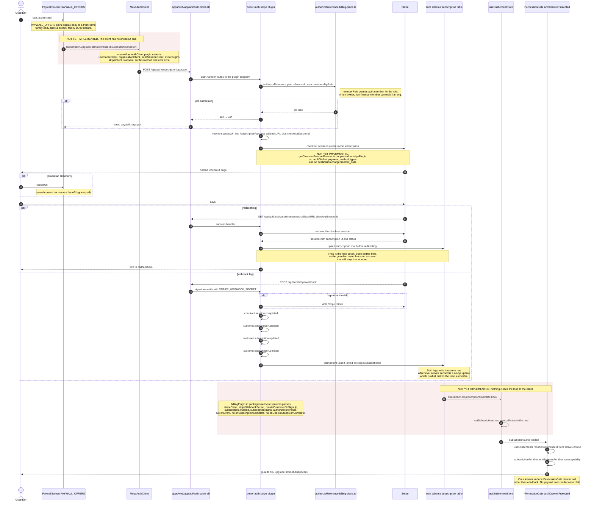

<!--
  Sequence diagram — family checkout, M1 (doc 12 §5, flow 2 of 5).
  Why it exists: doc 12 §9.1 asks for the checkout flow drawn with exact
  operation names and failure branches, including the redirect race that the
  Better Auth Stripe plugin's wrapped success URL covers. The plugin is
  installed and constructed; the call site, the checkout parameters, and the
  entitlement invalidation are not. Both halves are drawn, and the second half
  is labelled NOT YET IMPLEMENTED rather than assumed.
  SOT: docs/pack/12-systems-design-prompt.md §5 · docs/pack/06-auth-onboarding-spec.md §4 · docs/pack/05-monetization-access-spec.md §2 §5
  SOT-KEYWORDS: sequence diagram checkout stripe subscription webhook idempotent entitlement cache invalidation paywall redirect race ach destination charge
-->

# Family checkout (M1) — sequence

**Date:** Aug 27, 2026 · **Status:** design of record for §9.1 flow (b)
**Scope:** paywall tap → Stripe Checkout → webhook → projection → entitlement
cache invalidation → guards flip, including the checkout-vs-webhook race.

Doc 06 §4 is explicit that we do not solve the race ourselves: *"rely on the
plugin's wrapped success URL (subscription state settles before redirect)."*
The plugin does this by rewriting the caller's `successUrl` into its own
`/subscription/success?callbackURL=<caller url>&checkoutSessionId={CHECKOUT_SESSION_ID}`
and reconciling the session in that handler before issuing the redirect. That
route is verified present in the installed
`@better-auth/stripe` build, alongside `/subscription/upgrade`,
`/subscription/list`, `/subscription/cancel`, `/subscription/billing-portal`,
`/subscription/restore`, and `/stripe/webhook`.

---

## The diagram

---

## Failure branches

| Branch | Behaviour today | Symbol |
|---|---|---|
| Caller may not bill this reference | `authorizeReference` returns `{ ok: false }`; the plugin refuses before Stripe is touched | `packages/auth/src/billing-plans.ts` : `authorizeReference`, `isBillingRole`, `BILLING_ROLES` |
| Org member without a billing role | `memberRole` returns e.g. `member`; `isBillingRole` false | `packages/auth/src/server.ts` : `memberRole` |
| Stripe not configured on this machine | `billingPlugin` returns `[]` — the plugin is omitted entirely and the app still boots; `/subscription/*` routes 404 | `packages/auth/src/server.ts` : `billingPlugin` |
| No priced plan resolved from env | `resolvePrices()` yields an empty `priced` list; `billingPlugin` returns `[]` for the same reason | `packages/auth/src/billing-plans.ts` : `resolvePrices` |
| Webhook signature invalid | Plugin rejects; Stripe retries on its own schedule | `@better-auth/stripe` `/stripe/webhook` |
| Webhook lags the redirect | Covered by the wrapped success URL — the success handler reconciles from the checkout session itself | `/subscription/success` |
| Webhook truth has not arrived at the client | `PermissionGate` renders `pending ?? children` while `loaded` is false, so a paying customer never sees an upsell for a beat | `packages/app/providers/entitlements/permission-gate.tsx` : `PermissionGate` |
| Subscription lapses | `entitlementsFor` maps status to capabilities; `shouldOfferUpgrade` drives S17 copy | `packages/auth/src/entitlements.ts` : `entitlementsFor`, `SubscriptionState`, `NO_SUBSCRIPTION` |

---

## Seams this diagram relies on

| Seam | File : symbol |
|---|---|
| Paywall offers and plan pairing | `packages/app/features/paywall/paywall.data.ts` : `PAYWALL_OFFERS`, `PaywallOffer`, `formatTrialDate` |
| Cancel path copy | `packages/app/features/paywall/cancel-content.tsx` |
| Plan catalogue and price resolution | `packages/auth/src/billing-plans.ts` : `PLANS`, `PlanName`, `PlanLimits`, `plansFor`, `resolvePrices`, `isPlanName` |
| Reference authorization | `packages/auth/src/billing-plans.ts` : `authorizeReference`, `ReferenceRequest`, `isBillingRole` |
| Plugin construction | `packages/auth/src/server.ts` : `createAuth`, `billingPlugin`, `memberRole` |
| Better Auth HTTP surface | `apps/web/app/api/auth/[...all]/route.ts` : `GET`/`POST`/`PUT`/`DELETE`/`PATCH` = `auth.handler` · `apps/web/lib/auth.ts` : `auth` |
| Auth client factory | `packages/auth/src/client.ts` : `createMoyoAuthClient`, `MoyoAuthClient` |
| Subscription projection shape | `packages/auth/src/entitlements.ts` : `SubscriptionState`, `SubscriptionStatus`, `subscriptionFor` |
| Entitlement derivation | `packages/auth/src/entitlements.ts` : `entitlementsFor`, `can`, `Capability`, `daysLeft` |
| Entitlement cache | `packages/app/providers/entitlements/store.ts` : `useEntitlementStore`, `setSubscriptions`, `reset` |
| Entitlement resolution per active context | `packages/app/providers/entitlements/use-entitlements.ts` : `useEntitlements`, `ResolvedEntitlements` |
| Client guard | `packages/app/providers/entitlements/permission-gate.tsx` : `PermissionGate` |
| Route guards | `apps/mobile/app/(drawer)/_layout.tsx` : `Drawer.Protected` guards (`isLearner`, `isGuardian`, `isStaff`) |
| Trial schedule and cancellation | `packages/auth/src/trial.ts` : `trialSchedule`, `TRIAL_REMINDER_DAYS_BEFORE`, `cancellationOutcome`, `cancellationSummary`, `CANCEL_STEPS` |

## NOT YET IMPLEMENTED

1. **The checkout call site.** Nothing in the tree calls
   `/subscription/upgrade`. A repo-wide grep for `successUrl`, `success_url`,
   `cancelUrl`, and `checkout` across `packages/auth` and
   `packages/app/features/paywall` returns one hit, and it is a test name in
   `packages/auth/src/billing.test.ts`.
2. **`stripeClient` on the auth client.** `createMoyoAuthClient` in
   `packages/auth/src/client.ts` registers `usernameClient`,
   `organizationClient`, `multiSessionClient`, and `expoPlugins`. Without
   `stripeClient({ subscription: true })` there is no typed
   `authClient.subscription.*` surface, so the paywall cannot start a checkout
   even if it wanted to.
3. **ACH-first and the destination charge.** Doc 12 §5 specifies "destination
   charge, ACH-first". `billingPlugin` passes no `getCheckoutSessionParams`, so
   the Checkout Session is created with plugin defaults — card, no
   `payment_intent_data`, no `transfer_data`, no `on_behalf_of`. Doc 05 §5 also
   records that under a destination charge **the platform owns negative
   balances**; that liability decision is unmade in code.
4. **Entitlement cache invalidation.** `setSubscriptions` is declared in the
   store's interface and implemented in the store, and has **no caller anywhere
   in the repo**. Nothing fetches `/subscription/list`, and no plugin hook
   (`onEvent`, `onSubscriptionComplete`, `onCheckoutSessionComplete`) is wired.
   The client entitlement cache is therefore permanently `loaded: false`, which
   `PermissionGate` treats as "render the children" — i.e. **every capability
   currently reads as granted on the client**. The server does not compensate,
   because there is no server-side plan gate (see
   `docs/design/seq-learner-ai-turn.md`, *The Block's own gate order*).
5. **The registry.** Doc 11 §3 and doc 12 §3 both put "plan & entitlement
   (registry)" in the Block, and doc 11 §5 specifies one registry owning plans,
   entitlements, permissions, nav gating and upgrade copy. `packages/app/core/`
   contains exactly one file, `protected-operation.ts`. There is no registry, so
   "registry entitlement cache invalidation" has no object to invalidate.
6. **A `subscriptions` Payload collection.** Doc 05 §5 names `subscriptions`,
   `connectedAccounts`, `feeConfigs`, and `refundsDisputes` as operational
   collections. `packages/payload/src/payload-types.ts` `Config['collections']`
   lists `users`, `media`, `guardianships`, `consents`, `skills`,
   `misconceptions`, `sessionTranscripts`, `tutorSessions`, `studentModelFacts`,
   `organizations`, `leads` and the four `payload-*` system collections. None of
   the billing collections exist. The only local projection of Stripe truth is
   the plugin's own `subscription` table in the `auth` schema.
7. **Server-side route guards on web.** Only `apps/mobile` uses
   `Drawer.Protected`. Doc 05 PR-9's "server layout checks on web" are not
   present.
