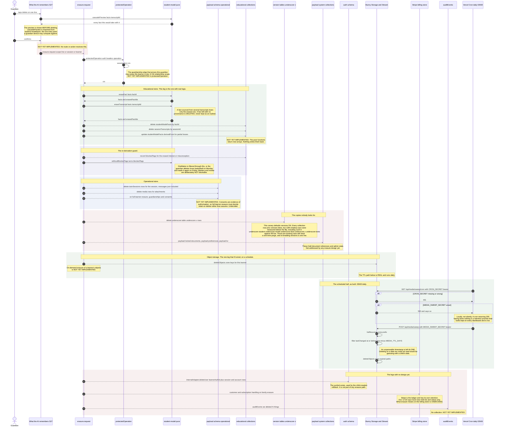

<!--
  Sequence diagram — the erasure cascade (doc 12 §5 and §4, flow 5 of 5).
  Why it exists: doc 12 §9.1 asks for the cascade drawn across the operational,
  educational and billing stores, the version tables, and the Bunny objects.
  The cascade LOGIC exists and is tested; the cascade DRIVER does not — the pure
  functions in packages/student-model have no caller outside their own package.
  Only the Bunny leg is wired end to end. This diagram separates the two so a
  later worker does not read a green test suite as a shipped promise.
  SOT: docs/pack/12-systems-design-prompt.md §4 §5 · docs/pack/07-security-child-ai-safety-spec.md §4 · docs/pack/19-learning-outcomes-spec.md §3
  SOT-KEYWORDS: sequence diagram erasure cascade delete provenance transcript fact bunny version tables retention ttl guardian right to delete
-->

# Erasure cascade — sequence

**Date:** Aug 27, 2026 · **Status:** design of record for §9.1 flow (e)
**Scope:** a guardian deleting a line or a session, and the TTL sweep that does
the same thing on a schedule, across every store that holds a copy.

The promise being kept is doc 07 §4's: *"any line is deletable; erasure cascades
through derived artifacts."* The failure mode it exists to prevent is named in
`packages/student-model/src/erasure.ts` — the row disappears from the screen,
the derived artifact keeps the belief, and the tutor goes on saying the deleted
thing. That is why deletion here is defined on **provenance**, not on rows.

**What is real:** the cascade algebra (`eraseFact`, `eraseTranscript`,
`cascadePreview`, `expireTranscripts`, `withoutBlockedTags`), and the Bunny
Storage sweep (`POST /api/media/sweep` + its cron door).
**What is not:** any caller that applies the algebra to the database.

---

## The diagram

---

## The TTL ladder, and why the windows differ

Doc 07 §4's reasoning, as encoded: *the further something is from the child's
own voice, the longer it may live.*

| Artifact | Window | Symbol |
|---|---|---|
| Uploaded media — a photo of handwriting, a voice recording | **7 days** | `packages/app/features/media/retention.ts` : `MEDIA_TTL_DAYS`, `mediaExpiry`, `isMediaExpired`, `expiredKeys` |
| Raw session transcript | **30 days** | `packages/student-model/src/facts.ts` : `TRANSCRIPT_TTL_DAYS` · `packages/student-model/src/distill.ts` : `transcriptExpiry` |
| Derived fact | **400 days** | `packages/student-model/src/facts.ts` : `FACT_TTL_DAYS` |

The text survives the media: the OCR reading and the voice-note transcription
are what the tutoring was built on, and they live under the transcript's own
30-day window. What expires at 7 days is the original capture of the child.

Both `sessionTranscripts.expiresAt` and `studentModelFacts.expiresAt` are
declared `index: true`, so the sweep query has an access path. `tutorSessions`
also carries an indexed `expiresAt`.

## Seams this diagram relies on

| Seam | File : symbol | Status |
|---|---|---|
| Cascade algebra | `packages/student-model/src/erasure.ts` : `eraseFact`, `eraseTranscript`, `cascadePreview`, `expireTranscripts`, `withoutBlockedTags`, `ErasureResult` | real, unit-tested, **no caller** |
| Guardian-device entry point | `packages/student-model/pure.ts` : re-exports `eraseFact`, `eraseTranscript`, `cascadePreview` | real |
| Server barrel | `packages/student-model/index.ts` : re-exports the above plus `expireTranscripts` | real |
| Provenance edge | `packages/student-model/src/facts.ts` : `DerivedFact.derivedFrom`, `FactProvenance`, `FACT_TTL_DAYS`, `TRANSCRIPT_TTL_DAYS`, `isExpired`, `addDays` | real |
| Transcript shape and expiry | `packages/student-model/src/distill.ts` : `SessionTranscript`, `SessionTurn`, `transcriptExpiry`, `factId`, `distill` | real |
| Educational collections | `packages/payload/src/collections/SessionTranscripts.ts` (`sessionId`, `learnerAuthId`, `turns`, `capturedAt`, `expiresAt`, `distilledAt`) · `packages/payload/src/collections/StudentModelFacts.ts` (`factId`, `learnerAuthId`, `kind`, `skill`, `sentence`, `detail`, `derivedFrom`, `observedAt`, `expiresAt`) | real |
| Operational collections | `packages/payload/src/collections/TutorSessions.ts` (`sessionId`, `learnerAuthId`, `problem`, `messages`, `closedAt`, `expiresAt`) · `Media.ts` · `Guardianships.ts` · `Consents.ts` | real |
| Version-table policy | `versions: false` on all eleven domain collections — `Leads.ts` (carries the canary reasoning), `Organizations.ts`, `SessionTranscripts.ts`, `StudentModelFacts.ts`, `TutorSessions.ts`, `Consents.ts`, `Guardianships.ts`, `Media.ts`, `Misconceptions.ts`, `Skills.ts`, `Users.ts` | real |
| Generated collection census | `packages/payload/src/payload-types.ts` : `Config['collections']` — note it lists **no** `*_versions` entries even when versions are on, so it cannot be used to prove shadow tables are absent | real |
| Media retention | `packages/app/features/media/retention.ts` : `MEDIA_TTL_DAYS`, `mediaExpiry`, `isMediaExpired`, `expiredKeys` | real |
| Bunny listing and deletion | `apps/web/lib/bunny-list.ts` : `listRecursive`, `listFolder`, `BunnyObject` · `apps/web/lib/bunny-delete.ts` : `deleteObject`, `deleteObjects`, `BunnyZone` | real |
| Sweep routes | `apps/web/app/api/media/sweep/route.ts` : `POST` (bearer `MEDIA_SWEEP_SECRET`) · `apps/web/app/api/media/sweep/cron/route.ts` : `GET` (bearer `CRON_SECRET`, delegates to the `POST`) | real, wired |
| Auth-store deletion primitive | `packages/auth/src/payload-learner-writer.ts` : `createPayloadLearnerWriter().deleteUser` → `ctx.internalAdapter.deleteUser` | real, used only by the child-creation rollback |
| Session write path (what the cascade must undo) | `packages/app/features/tutor/session.service.ts` : `openSession`, `addMessage`, `attachUploadedMedia` · `apps/web/lib/tutor-session.repository.ts` : `createSession`, `appendMessage`, `patchAttachment` | real |
| Fact write path | `apps/web/lib/student-model.repository.ts` : `saveTranscript`, `saveFacts` | real |
| No-training-path gate | `tooling/check-no-training-path.mjs` (runs in `pnpm lint`) | real, and states in its own output that it is currently vacuous |

## NOT YET IMPLEMENTED

1. **A cascade driver.** `eraseFact`, `eraseTranscript`, `expireTranscripts`,
   `cascadePreview` and `withoutBlockedTags` have **no caller outside
   `packages/student-model`** — the only references are the two barrels and the
   test file. There is no route, no server action, no job. The algebra is
   correct and unreachable.
2. **`withoutBlockedTags` in the distillation path.** `distill` is called at
   `packages/app/features/tutor/tutor.service.ts:119` with
   `(transcript, priorFacts, now)`. `blockedTags` are never assembled, never
   stored, and never applied, so a deleted interest **will** be re-derived on the
   next session — the exact theatre the erasure design was written to avoid.
3. **A `blockedTags` store.** No collection or column holds them.
4. **Version-table coverage.** This is a live defect that has just been half
   fixed, and the half that remains is a data problem rather than a code one.

   Payload 4 canary defaults `versions` **on**, and mirrors every write into
   `_<table>_v`. The retention sweep and every erasure design target `expiresAt`
   on the main table only, so a transcript survived its own deletion in the
   shadow table — the schema worker's own comment in
   `packages/payload/src/collections/SessionTranscripts.ts` puts it exactly
   right: *"delete my child's data does not delete it."* Measured before the
   flip: **1,294 shadow rows across the schema**, with
   `_student_model_facts_v_texts` holding **1,119 rows against 49 live** — a 23×
   copy of derived learner facts that nothing was ever going to sweep.

   All eleven domain collections now pin `versions: false`. Two things still do
   not exist:
   - **a one-time purge of the shadow rows written before the flip.** Turning
     versions off stops new mirrors; it does not drop the existing `_v` tables or
     their contents.
   - **cascade coverage for `_<table>_v` as a standing rule.** `versions: true`
     is one line, and the next collection someone adds inherits the canary
     default unless they remember. The erasure driver must delete from `_v`
     unconditionally, and a lint or test should assert that no collection config
     omits an explicit `versions` value.

   Note also that `payload-types.ts` `Config['collections']` lists no
   `*_versions` entries **even when versions are on**. It is not evidence of
   absence; only the database is.
5. **Payload system collections.** `payload-locked-documents`,
   `payload-preferences` and `payload-kv` are in `Config['collections']` and hold
   document references and admin state. No erasure design addresses them.
6. **The billing store.** Doc 12 §9.1 asks the cascade to span it. Stripe is the
   ledger with its own retention and its own legal basis (1099s, disputes); local
   rows hold ids and status only. What erasure means there — detach the customer,
   delete it, or retain under a stated legal basis — is **undecided**, and
   inventing an answer here would be worse than naming the gap.
7. **On-demand Bunny deletion for a learner.** `deleteObjects` exists and is
   called only by the age-based sweep. There is no key-prefix-per-learner scheme
   and no erasure call site.
8. **Bunny Stream (video) deletion.** `apps/web/lib/bunny-stream.repository.ts`
   exports `createStreamVideo` and `signStreamUpload` only. There is no delete,
   and the storage sweep does not reach the Stream library — **uploaded videos
   currently have no retention path at all.**
9. **Auth-store erasure.** `deleteUser` exists but is not part of any erasure
   flow; sessions, accounts and org memberships are not addressed.
10. **The audit row.** `ErasureResult.erasedFactIds` is described in its own
    comment as being "for the audit row and for the *we deleted N things* copy".
    There is no `auditEvents` collection and no S27 confirmation copy.
11. **The failing-test-first gate.** Doc 12 §9.2 wants the erasure cascade
    landed as a failing test before the schema. The tests that exist
    (`packages/student-model/src/student-model.test.ts`) cover the pure algebra
    only — they prove the arrays are right, not that any row was deleted.
