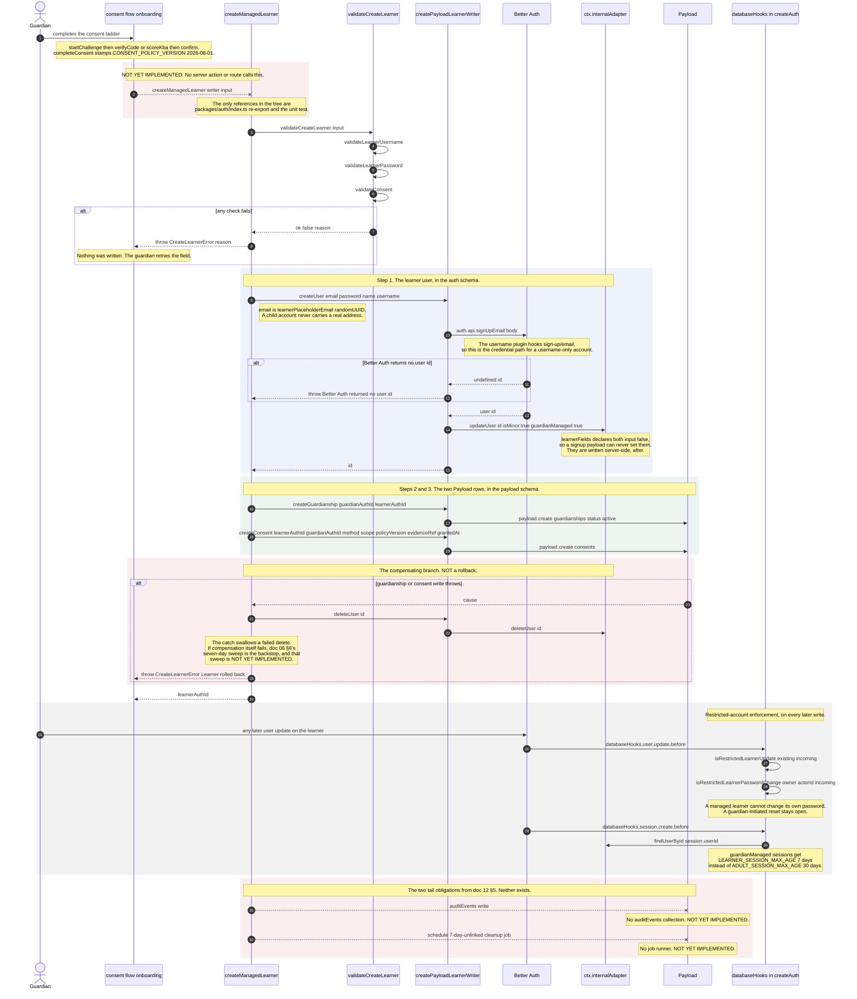

<!--
  Sequence diagram — guardian creates a child account (doc 12 §5, flow 3 of 5).
  Why it exists: doc 12 §9.1 asks for this flow with exact operation names and
  failure branches. Doc 12 §5 specifies "one transaction, audit event, 7-day
  unlinked cleanup job scheduled". The code deliberately does NOT use one
  transaction and says why in its own comment; the audit event and the cleanup
  job do not exist. All three are drawn honestly rather than aspirationally.
  SOT: docs/pack/12-systems-design-prompt.md §5 · docs/pack/06-auth-onboarding-spec.md §2 §3.1 §6
  SOT-KEYWORDS: sequence diagram guardian creates child managed learner consent guardianship restricted account rollback cleanup coppa audit
-->

# Guardian creates a child — sequence

**Date:** Aug 27, 2026 · **Status:** design of record for §9.1 flow (c)
**Scope:** the single server action of doc 06 §2 — Better Auth username user +
guardianship + consent record + restricted-account flags.

Doc 12 §5 says **"one transaction"**. The implementation is a *compensating
transaction*, and `packages/auth/src/create-managed-learner.ts` states the
reason in its own comment: the learner user lives in the Better Auth `auth`
schema and the guardianship and consent rows live in Payload's `payload` schema,
reached through a different client. There is no single transaction spanning
them. This diagram draws what runs; §5's wording is the aspiration, not the
code.

---

## The diagram

---

## Ordering, and why it is this order

The file's own header states it: *"Ordered so that a failure can never leave a
child account standing without the consent that authorised it."* The user is
created first because it is the only step that yields the id the other two rows
need; the compensation deletes it if either dependent write fails. The failure
mode being engineered against is a COPPA one — a live child account whose
consent record was never written.

The residual risk is named rather than hidden: if `deleteUser` also fails, the
`.catch(() => {})` swallows it and the orphan survives until a sweep that does
not exist runs. That makes the 7-day cleanup job (below) a **correctness**
requirement here, not just hygiene.

## Seams this diagram relies on

| Seam | File : symbol |
|---|---|
| The action | `packages/auth/src/create-managed-learner.ts` : `createManagedLearner`, `LearnerWriter`, `CreateLearnerError` |
| Input validation | `packages/auth/src/create-learner.ts` : `validateCreateLearner`, `validateLearnerUsername`, `validateLearnerPassword`, `validateConsent`, `CreateLearnerInput`, `ConsentMethod` |
| Placeholder identity | `packages/auth/src/create-learner.ts` : `learnerPlaceholderEmail`, `isPlaceholderEmail` |
| Port binding to the two real systems | `packages/auth/src/payload-learner-writer.ts` : `createPayloadLearnerWriter` |
| Better Auth instance, flags, session policy | `packages/auth/src/server.ts` : `createAuth`, `learnerFields`, `ADULT_SESSION_MAX_AGE`, `LEARNER_SESSION_MAX_AGE`, `Auth` |
| Restricted-account enforcement | `packages/auth/src/server.ts` : `isRestrictedLearnerUpdate`, `isRestrictedLearnerPasswordChange` (wired through `databaseHooks.user.update.before` / `databaseHooks.account.*`) |
| Consent ladder | `packages/auth/src/consent-flow.ts` : `availableMethods`, `startChallenge`, `verifyCode`, `scoreKba`, `confirm`, `completeConsent`, `ConsentRecord`, `CONSENT_POLICY_VERSION`, `needsReconsent`, `KBA_PASS_MARK`, `CODE_TTL_MINUTES`, `MAX_CODE_ATTEMPTS` |
| Consent UI state | `packages/app/features/onboarding/consent/consent.store.ts` · `consent-channel.ts` · `kba.data.ts` · `consent-flow-content.tsx` |
| Guardianship row | `packages/payload/src/collections/Guardianships.ts` : `slug: 'guardianships'`, fields `guardianAuthId`, `learnerAuthId`, `relationship`, `status` |
| Consent row | `packages/payload/src/collections/Consents.ts` : `slug: 'consents'`, fields `learnerAuthId`, `guardianAuthId`, `method`, `scope`, `policyVersion`, `evidenceRef`, `grantedAt` |
| Barrel | `packages/auth/index.ts` : re-exports `createManagedLearner`, `CreateLearnerError`, `createPayloadLearnerWriter` |
| Auth HTTP surface | `apps/web/app/api/auth/[...all]/route.ts` : `auth.handler` · `apps/web/lib/auth.ts` : `auth` |

## NOT YET IMPLEMENTED

1. **One transaction.** By design it is a compensating sequence, not a
   transaction; the source comment explains the two-schema reason. Doc 12 §5's
   "ONE transaction" is not achievable without moving the guardianship and
   consent writes onto the same connection as the Better Auth pool, which is a
   real design decision nobody has taken. Flagging it rather than drawing a
   `BEGIN` that does not exist.
2. **The audit event.** No `auditEvents` collection exists in
   `packages/payload/src/collections/` and none appears in
   `payload-types.ts` `Config['collections']`. `createManagedLearner` writes no
   audit row. Doc 07 §3 layer 10 and doc 05 PR-10 both depend on this store.
3. **The 7-day-unlinked cleanup job.** Doc 06 §3.1 copies Khan's hygiene rule
   ("unlinked child accounts deleted in a short window — 7 days"). There is no
   job runner in the repo at all: no `pg-boss` dependency, no `jobs` schema, no
   queue module. The only scheduled work that exists is a Vercel Cron GET at
   `apps/web/app/api/media/sweep/cron/route.ts`, which is media retention and
   nothing else. See `docs/design/seq-pay-run.md` for the full finding.
4. **The call site.** No server action, route handler, or screen calls
   `createManagedLearner`. The guardian onboarding steps
   (`packages/app/features/onboarding/guardian/steps.ts`, `store.ts`) and the
   consent flow are surfaces without a terminal write.
5. **Consent evidence storage.** `createConsent` accepts an optional
   `evidenceRef: string`. Doc 12 §3 puts consent evidence in a private Supabase
   Storage bucket; media in this product goes to Bunny
   (`apps/web/lib/bunny.repository.ts`). Neither is wired to consent evidence,
   so `evidenceRef` currently has no producer.
6. **Guardian-side password reset.** `isRestrictedLearnerPasswordChange` blocks
   the learner acting on itself and explicitly leaves the guardian-initiated
   path open, but no guardian-initiated reset operation exists to use it.
