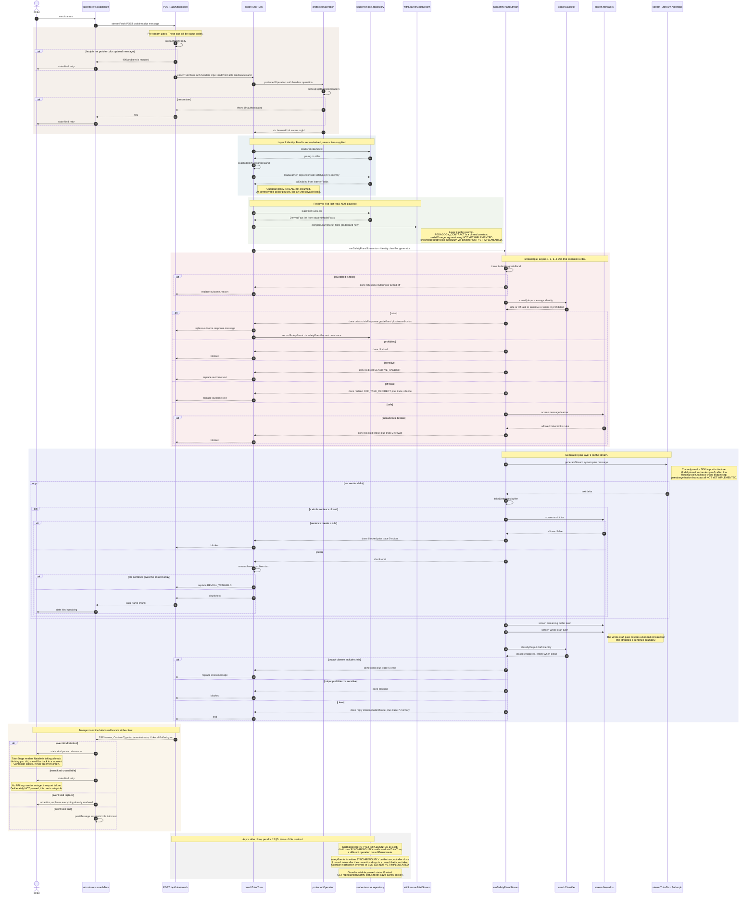

<!--
  Sequence diagram — the learner AI turn (doc 12 §5, flow 1 of 5).
  Why it exists: doc 12 §9.1 asks for the five binding flows drawn with exact
  operation names, gate order, and failure branches. This is the flow every
  other safeguard in the product exists to protect, so the diagram distinguishes
  what the tree actually does today from what doc 12 §5 specifies — anything
  drawn as `NOT YET IMPLEMENTED` has no symbol behind it and must not be cited
  as a seam by a later worker.
  SOT: docs/pack/12-systems-design-prompt.md §5 §7 · docs/pack/07-security-child-ai-safety-spec.md §3 §4 · docs/pack/18-tutor-ai-stack.md §2 §3
  SOT-KEYWORDS: sequence diagram learner ai turn safety plane stream sentence window fail closed coach sse inference gateway retrieval
-->

# Learner AI turn — sequence

**Date:** Aug 27, 2026 · **Status:** design of record for §9.1 flow (a)
**Scope:** one coaching turn, from a child's keystroke to a screened sentence on
screen, plus everything that is supposed to happen after the connection closes.

Read the [gate order](#gate-order-as-built) before the diagram. The order doc 12
§5 states and the order `packages/safety/src/plane.ts` executes are **not the
same order**, and the difference is load-bearing.

---

## The diagram

---

## Gate order as built

Doc 12 §5 writes the input side as "Safety L1–L4 (input class, topic fence)".
`screenInput` in `packages/safety/src/plane.ts` runs those layers in the order
**1 → 3 → 6 → 4 → 2**, and the trace labels say so. The deterministic firewall
(layer 2) runs **after** the model-shaped input classifier (layer 3), not before
it.

That is deliberate and worth stating rather than smoothing over in a diagram: a
message that is both a crisis disclosure *and* trips a firewall pattern must
route to the crisis protocol, not to a generic `blocked`. Ordering the firewall
first would swallow the disclosure. The cost is that a prohibited-pattern
message still pays for one classifier call — cheap today, because
`coachClassifier` is regex, and a real cost the day layer 3 becomes a model call
per doc 18 §3.

| # | Layer | Symbol | Verdicts |
|---|---|---|---|
| 1 | Identity context | `plane.ts:screenInput` trace `1-identity` | `refused` when `aiEnabled` is false |
| 3 | Input classification | `tutor-safety.ts:coachClassifier.classifyInput` | `crisis` · `prohibited` · `sensitive` · `off-task` · `safe` |
| 6 | Crisis protocol | `crisis.ts:crisisResponse` | terminal `crisis` |
| 4 | Topic fence | `plane.ts` `OFF_TASK_REDIRECT` | `redirect` |
| 2 | Two-directional firewall (inbound) | `firewall.ts:screen(message, 'learner')` | `blocked` with `FirewallRuleId[]` |
| 5 | Output screening, per sentence | `firewall.ts:screen(emit, 'tutor')` inside the `takeSentences` window | `blocked` |
| 5 | Output screening, whole draft | `firewall.ts:screen(draft, 'tutor')` | `blocked` |
| 5 | Output classification | `tutor-safety.ts:coachClassifier.classifyOutput` | `crisis` · `prohibited` |
| 7 | Memory hygiene | `crisis.ts:isPedagogicallyStorable` | sets `storeInStudentModel` |

### The Block's own gate order

Doc 12 §3 and doc 11 §3 both specify the Block as
`session → ctx → relationship scope → role → permission → plan → rate limit →
validation → [Safety Plane branch] → handler → audit/usage`.

`packages/app/core/protected-operation.ts:protectedOperation` implements
**`session → ctx` and nothing else.** Its real signature is
`protectedOperation<R>(auth: Auth, headers: Headers, operation: (ctx: ProtectedCtx) => Promise<R>)`
— it takes no `resource`, no `action`, no `rateLimit`, and returns no telemetry.
It throws the string `'Unauthenticated'` when `auth.api.getSession` returns
nothing, and every route maps that string to a 401 by comparing it.

Everything between "ctx" and "handler" in that chain is **NOT YET IMPLEMENTED**:

- relationship-scope resolution (doc 11 §4) — no resolver exists
- membership / role gate — `memberRole` in `packages/auth/src/server.ts` is read
  only by the Stripe plugin's `authorizeReference`, never by the Block
- permission gate from a registry — **the registry does not exist**;
  `packages/app/core/` contains exactly one file
- plan / entitlement gate on the server — entitlements are evaluated
  **client-side only**, in `packages/app/providers/entitlements/`
- rate limit — no policy type, no store
- input validation as a Block stage — each route hand-rolls it
  (`isCoachBody` in the coach route, a manual `gradeBand` check in the learner
  profile route)
- audit / usage emission — no `auditEvents` collection, no logger call

There is also a mock branch: with `NEXT_PUBLIC_AUTH_MODE=mock` **and**
`NODE_ENV=development`, `protectedOperation` returns a fixed ctx
(`learnerId: 'dev-learner-1'`, `orgId: 'riverside-unified'`) without touching
Better Auth. Any latency or availability measurement taken in that mode is
measuring nothing.

---

## Seams this diagram relies on

| Seam | File : symbol |
|---|---|
| Client turn driver, SSE reader, paused/retry mapping | `packages/app/features/tutor/tutor.store.ts` : `useTutorStore`, `readCoachEvents`, `API_URL` |
| Platform-forked streaming fetch | `packages/app/features/tutor/stream-fetch.ts` : `streamFetch` |
| SSE route, body guard, cancel teardown | `apps/web/app/api/tutor/coach/route.ts` : `POST`, `isCoachBody` |
| Turn orchestration and wire contract | `packages/app/features/tutor/coach.service.ts` : `coachTutorTurn`, `coachStream`, `CoachEvent`, `CoachPorts`, `LoadGradeBand`, `LoadLearnerFlags` |
| Safety-event shape, categories and retention | `packages/safety/src/events.ts` : `SafetyEvent`, `safetyEventFor`, `pausedSafetyEvent`, `externalRefusalSafetyEvent`, `isTutoringPaused`, `SAFETY_EVENT_TTL_DAYS`, `PAUSE_STATUS_MINUTES` |
| Safety-event write from the boundary | `packages/app/features/tutor/safety-events.ts` : `RecordSafetyEvent`, `recordPlaneOutcome`, `recordTurnFailure` · `apps/web/lib/safety-event.repository.ts` : `recordSafetyEvent`, `loadGuardianSafetyEvents` |
| Guardian-visible status | `packages/app/features/ai-activity/safety-status.service.ts` : `guardianSafetyStatus`, `safetyStatusFrom` · `apps/web/app/api/guardian/safety-status/route.ts` · `packages/app/features/ai-activity/safety-section.tsx` |
| Guardian policy (`aiEnabled`) | `packages/auth/src/server.ts` : `learnerFields`, `readLearnerFlags`, `LearnerFlags` · `apps/web/lib/learner-flags.repository.ts` : `loadLearnerFlags` |
| Auth boundary | `packages/app/core/protected-operation.ts` : `protectedOperation`, `ProtectedCtx` |
| Server-only barrel | `packages/app/server.ts` : re-exports `coachTutorTurn`, `CoachEvent`, `LoadGradeBand` |
| Grade-band and prior-fact reads | `apps/web/lib/student-model.repository.ts` : `loadGradeBand`, `loadPriorFacts`, `saveTranscript`, `saveFacts` |
| Identity context construction | `packages/app/features/tutor/tutor-safety.ts` : `coachIdentity` |
| Input/output classifier (regex floor) | `packages/app/features/tutor/tutor-safety.ts` : `coachClassifier`, `CRISIS_PATTERNS`, `SENSITIVE_PATTERNS`, `PROHIBITED_PATTERNS` |
| Streaming Safety Plane | `packages/safety/src/plane.ts` : `runSafetyPlaneStream`, `screenInput`, `takeSentences`, `PlaneStreamEvent`, `IdentityContext` |
| Deterministic firewall | `packages/safety/src/firewall.ts` : `screen`, `FirewallRuleId` |
| Crisis response and memory hygiene | `packages/safety/src/crisis.ts` : `crisisResponse`, `isPedagogicallyStorable`, `CrisisResponse` |
| Brief compilation and prompt assembly | `packages/student-model/src/brief.ts` : `compileLearnerBrief`, `LearnerBrief` · `packages/student-model/src/inference.ts` : `withLearnerBriefStream`, `ModelStreamCall`, `TutorPrompt`, `briefPreamble` |
| Vendor adapter | `packages/app/features/tutor/tutor-model.ts` : `streamTutorTurn`, `TUTOR_MODEL`, `MAX_TOKENS` |
| Answer-reveal guard | `packages/app/features/tutor/pedagogy.ts` : `revealsAnswer`, `PEDAGOGY_CONTRACT`, `REVEAL_WITHHELD` |
| Paused-state surface and copy | `packages/ui/TutorStage.tsx` : `TutorStageState` `'paused'` case (line 231 renders the break copy) |
| Session persistence for the turn | `packages/app/features/tutor/session.service.ts` : `openSession`, `addMessage` · `apps/web/lib/tutor-session.repository.ts` : `loadOpenSession`, `createSession`, `appendMessage` |
| Safety-event collection | `packages/payload/src/collections/SafetyEvents.ts` · `packages/payload/migrations/safety_events_additive.sql` |
| Transcript / fact collections | `packages/payload/src/collections/SessionTranscripts.ts` · `packages/payload/src/collections/StudentModelFacts.ts` · `packages/payload/src/collections/TutorSessions.ts` |

## NOT YET IMPLEMENTED

Named here so nobody draws them as seams. Each line is a thing doc 12 §5
specifies for this flow and the tree does not contain.

1. **Retrieval over a knowledge graph and curriculum via pgvector.** There is no
   `embeddings` table, no `edu` schema, no vector query and no `pgvector`
   reference anywhere outside the specs. What exists is
   `loadPriorFacts` → a `payload.find` on `studentModelFacts` filtered by
   `learnerAuthId`, `limit: 1000`, fed straight to `compileLearnerBrief`. That is
   a flat read of derived facts, not retrieval.
2. **An Inference Gateway.** No module owns model egress. `coach.service.ts`
   imports `streamTutorTurn` directly. Consequently there is no provider adapter
   interface, no routing table (doc 12 §7's small-model-for-classification split
   does not exist — `coachClassifier` is regex, so today there is exactly one
   provider call per turn, not the 2–6 §7 models), no fallback chain, and no
   per-learner daily inference budget.
3. **A pseudonymization boundary.** The property holds structurally — the prompt
   assembled by `withLearnerBriefStream` carries only the brief and the turn, and
   `ProtectedCtx.learnerId` never reaches `streamTutorTurn` — but no module
   asserts it and no test guards it. It is an accident of composition, not a
   boundary.
4. **~~`aiEnabled` from guardian policy.~~ WIRED.** `learnerFields` in
   `packages/auth/src/server.ts` carries `aiEnabled` (`input: false`, defaults
   ON so no existing learner is refused by a column arriving), the boundary
   reads it through `LoadLearnerFlags` → `apps/web/lib/learner-flags.repository.ts`
   → `readLearnerFlags`, and it runs inside `safetyLayer('1-identity')` —
   guardian policy is layer 1, so an unresolvable policy pauses rather than
   defaulting. `tooling/check-fail-closed.mjs` lists `loadLearnerFlags` beside
   `loadGradeBand` in `IDENTITY_LOOKUPS`, so moving it out of the wrapper fails
   the build. The `refused` branch is reachable and covered by
   `fail-closed.server-test.ts`. **Still missing:** any UI for a guardian to
   TOGGLE the flag — it can be read and honoured, and is set server-side.
5. **~~Fail-closed on classifier or firewall *unavailability*.~~ WIRED**, and
   extended. `safetyLayer`/`safetyLayerSync` turn any layer failure into
   `SafetyLayerUnavailable`, which the boundary's catch maps to `blocked` →
   `paused`. `ModelDeclined` joins it: a PROVIDER refusal is a safety verdict,
   not a socket, and doc 12 §5's failure table routes a surviving refusal to the
   pause — it used to fall through to `unavailable` → `retry`, which offered a
   child a second attempt at the same refusal.
6. **~~`safetyEvents` + the alert pipeline (S26).~~ COLLECTION AND WRITE WIRED.**
   `packages/payload/src/collections/SafetyEvents.ts` (`versions: false`,
   `update: () => false`), `packages/payload/migrations/safety_events_additive.sql`,
   written from the coaching boundary via `RecordSafetyEvent` →
   `apps/web/lib/safety-event.repository.ts`. `PlaneResult.trace` is no longer
   discarded — it is the row's `trace` column. Retention is the store's OWN:
   `SAFETY_EVENT_TTL_DAYS` is 90 against the transcript's 30 and a fact's 400,
   swept by the same job through `packages/payload/src/retention/sweep.sql`.
   **Still missing:** push delivery (email/SMS per guardian preference, doc 07
   §S26's a11y line) and the human review queue. The record exists and is
   readable; nothing is yet pushed at anybody.
7. **~~Guardian-visible paused status.~~ WIRED.** `GET /api/guardian/safety-status`
   → `guardianSafetyStatus` (inside `protectedOperation`, scoped by ACTIVE
   guardianships) → the Safety section at the top of S12
   (`packages/app/features/ai-activity/safety-section.tsx`). It leads the screen
   because a stopped tutor is a thing a parent must be told, not a thing they
   came to read. `unreachable` is its own rendered state: a status that falls
   back to "all clear" when the read failed is the one lie this surface must not
   tell.
8. **The distillation job.** `distill` is called synchronously at
   `packages/app/features/tutor/tutor.service.ts:119`, inside `evaluateTutorTurn`
   (the answer-check operation, `POST /api/tutor/evaluate`), not asynchronously
   after a coaching session closes. There is no job runner — see
   `docs/design/seq-pay-run.md` for the pg-boss finding.
9. **Layer 8's `redTeamRuns` record.** `packages/safety/src/red-team.ts` exists
   and `packages/safety/src/safety.test.ts` runs it; nothing persists a run.
10. **Block telemetry.** `protectedOperation` emits no
    `{op, resource, action, ctx.kind, latency, outcome}` record, which is what
    `docs/design/slo.md` needs before any of its rules can fire.
