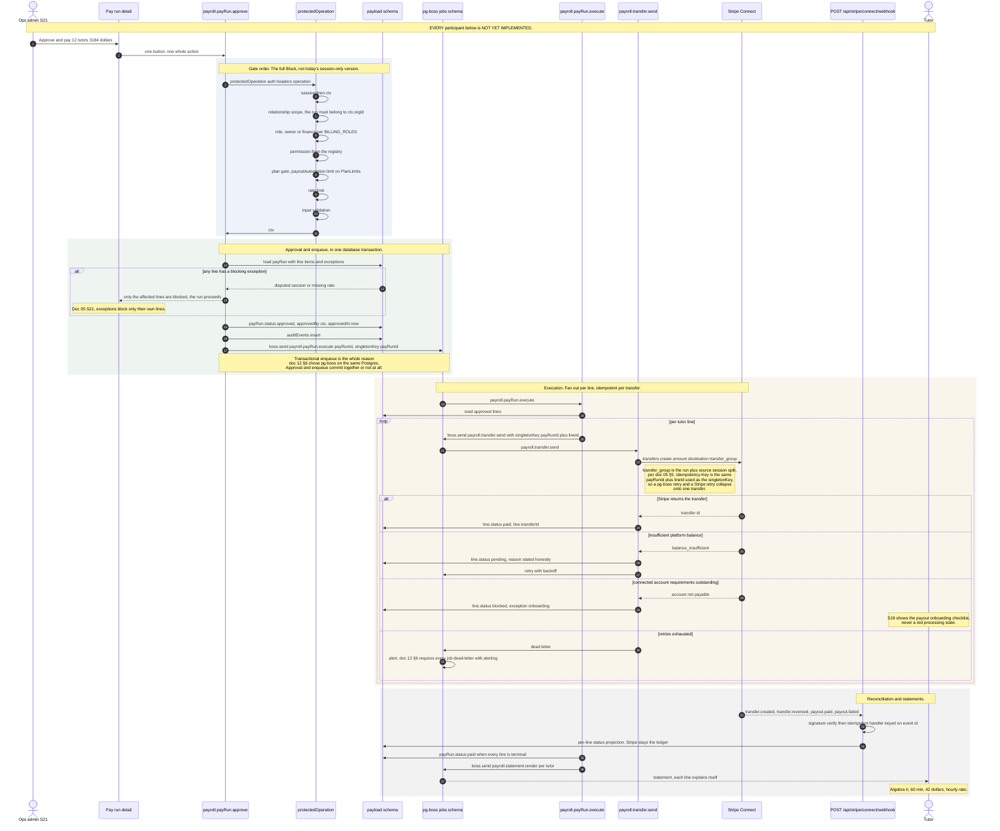

<!--
  Sequence diagram — the pay run, M2 (doc 12 §5, flow 4 of 5).
  Why it exists: doc 12 §9.1 asks for this flow with exact operation names, gate
  order, and failure branches. Unlike the other four flows, this one has NO
  implemented seams whatsoever — no job runner, no Connect wiring, no payroll
  collections. Drawing it as if it existed would be the exact failure mode §1 of
  the prompt forbids, so every participant carries its status and the design is
  stated as a specification to be built against, with the Stripe primitives it
  will use named from doc 05 §5 rather than invented.
  SOT: docs/pack/12-systems-design-prompt.md §5 §6 §7 · docs/pack/05-monetization-access-spec.md §5.3 §6 S19 S21
  SOT-KEYWORDS: sequence diagram pay run payroll pg-boss stripe connect separate charges transfers transfer_group idempotent statement dead letter shed order
-->

# Pay run (M2) — sequence

**Date:** Aug 27, 2026 · **Status:** design of record for §9.1 flow (d)
**Scope:** approval → batch job → Stripe SCT transfers per `transfer_group` →
per-line status projection → tutor statements.

> **Nothing in this flow is implemented.** This is the honest headline. A
> repo-wide search finds no `pg-boss` dependency, no `jobs` schema, no queue
> module, no Stripe Connect code, and none of the seven payroll collections doc
> 05 §5 names. The diagram below is therefore a **specification**, not a
> description, and every participant is marked. It is drawn now because doc 12
> §9.1 asks for it and because the idempotency and shed-order decisions belong
> on paper before the first line of it is written.
>
> The only Stripe code in the tree is the Better Auth subscription plugin
> (`packages/auth/src/server.ts:billingPlugin`) — Billing, not Connect.

---

## The diagram

---

## Idempotency, stated once

Retries are idempotent **per transfer**, not per run. The key is
`${payRunId}:${lineId}` and it is used in three places so that a retry at any
layer collapses onto the same money movement:

1. as the pg-boss `singletonKey` on `payroll.transfer.send`, so the queue will
   not hold two live jobs for one line;
2. as the Stripe `Idempotency-Key` on `transfers.create`, so a network retry
   after a successful create returns the original transfer rather than making a
   second one;
3. as a unique constraint on the `transfers` projection row, so a webhook that
   arrives twice is a no-op update.

The run-level job (`payroll.payRun.execute`) carries `singletonKey: payRunId`
for the same reason at the coarser grain: a double-click on Approve enqueues
once.

## Queue topology and shed order

Doc 12 §7's failure-mode line is binding and is the reason this section exists
before the queues do:

> job backlog → dead-letter alert + **shed non-critical queues first (reminders
> before pay runs, never safety alerts)**.

| Queue | Priority | Shed order | Notes |
|---|---|---|---|
| `safety.alert.*` | highest | **never shed** | Doc 07 §3 layer 6. Guardian crisis alerts. |
| `payroll.transfer.send` | high | shed 3rd | Money already approved. |
| `payroll.payRun.execute` | high | shed 3rd | |
| `payroll.statement.render` | normal | shed 2nd | Cosmetic delay only. |
| `edu.distill` | normal | shed 2nd | Delays personalization, not safety. |
| `retention.sweep` | normal | shed 2nd | Has its own TTL slack. |
| `notify.reminder.*` | low | **shed 1st** | Doc 12 §7 names reminders as the first thing to drop. |

`docs/design/slo.md` carries the alert rules that make a shed decision visible.

## Seams this diagram relies on

Two, and only two, and neither is payroll:

| Seam | File : symbol | What it gives this flow |
|---|---|---|
| Auth boundary | `packages/app/core/protected-operation.ts` : `protectedOperation`, `ProtectedCtx` | The `session → ctx` half of the gate order. Everything after `ctx` in the diagram is unbuilt — see `docs/design/seq-learner-ai-turn.md`, *The Block's own gate order*. |
| Billing roles | `packages/auth/src/billing-plans.ts` : `BILLING_ROLES`, `isBillingRole`, `authorizeReference`, `PlanLimits.payoutAutomation` · `packages/auth/src/server.ts` : `memberRole` | The role and plan gates the approval operation will reuse. `payoutAutomation` already exists on `PlanLimits` and is already read by `billingPlugin`. |

Adjacent surfaces that exist but are not part of this flow:
`packages/app/features/ops/ops.service.ts` (`listLeads`, `commitStageChange`) is
the CRM, not payroll; `apps/web/app/api/ops/leads/route.ts` is its only route.

## NOT YET IMPLEMENTED

Everything. Enumerated so the gap is countable rather than a shrug.

1. **pg-boss.** No dependency in any `package.json`, no `jobs` schema, no boss
   instance, no queue names. Doc 12 §6 chose it; nothing installed it. The only
   scheduled execution in the repo is
   `apps/web/app/api/media/sweep/cron/route.ts` (Vercel Cron, `GET`,
   `CRON_SECRET` bearer) delegating to `apps/web/app/api/media/sweep/route.ts`.
   That is one cron, not a job runner: no retries, no dead-letter, no
   idempotency key, no priorities.
2. **Stripe Connect.** No connected-account creation, no `transfers.create`, no
   `transfer_group`, no Connect webhook route. `apps/web/app/api/` contains
   `progress`, `auth`, `learner`, `tutor`, `ops`, `media` — no `stripe`
   directory at all. The Stripe webhook that does exist is the Better Auth
   plugin's `/api/auth/stripe/webhook`, which handles four Billing events
   (`checkout.session.completed`, `customer.subscription.created`/`.updated`/
   `.deleted`) and nothing else.
3. **The payroll collections.** Doc 05 §5 names `payRates`, `payRuns` (+ line
   items), `transfers`, `connectedAccounts`, `feeConfigs`, `refundsDisputes` and
   `subscriptions`. `payload-types.ts` `Config['collections']` contains none of
   them.
4. **`auditEvents`.** Required at approval. No collection.
5. **The S21 approval surface and the S19 tutor earnings surface.**
   `packages/app/features/` has no payroll or earnings feature directory.
6. **The full Block gate order** that the approval operation depends on — the
   relationship, role, permission, plan, rate-limit and validation stages do not
   exist in `protectedOperation`.
7. **Dead-letter alerting.** Depends on both pg-boss and the observability
   pipeline in `docs/design/slo.md`, neither of which is wired.
